# ExamOS — System Architecture

**Document type:** Architecture reference (current implementation + proposed target)
**Repository:** `avexora-examos` (submodule of `ExamOS`)
**Branch / HEAD at time of writing:** `dev` / `5381f41`
**Audit date:** 2026-09-29
**Mode:** Read-only source audit. The only file created is this document. No application code, configuration, schema, dependency, or test was modified. No code was executed against a database or a network.

---

## Table of Contents

1. [Executive Summary](#1-executive-summary)
2. [Evidence and Labelling Conventions](#2-evidence-and-labelling-conventions)
3. [System Context](#3-system-context)
4. [Runtime and Deployment](#4-runtime-and-deployment)
5. [Request Lifecycle](#5-request-lifecycle)
6. [Frontend Architecture](#6-frontend-architecture)
7. [Backend Architecture](#7-backend-architecture)
8. [Authentication](#8-authentication)
9. [Authorization and RBAC](#9-authorization-and-rbac)
10. [Multi-Tenancy and the Tenant Boundary](#10-multi-tenancy-and-the-tenant-boundary)
11. [Institution Login and Custom Domains](#11-institution-login-and-custom-domains)
12. [Examination Lifecycle](#12-examination-lifecycle)
13. [OMR Pipeline](#13-omr-pipeline)
14. [File Storage](#14-file-storage)
15. [Data Model and Collections](#15-data-model-and-collections)
16. [API Surface](#16-api-surface)
17. [Security Controls](#17-security-controls)
18. [Audit and Observability](#18-audit-and-observability)
19. [Testing and Quality](#19-testing-and-quality)
20. [Architectural Problems](#20-architectural-problems)
21. [Target Architecture (PROPOSED)](#21-target-architecture-proposed)
22. [Migration Plan (PROPOSED)](#22-migration-plan-proposed)
23. [Architecture Decision Records](#23-architecture-decision-records)
24. [Risks](#24-risks)
25. [Open Questions](#25-open-questions)
26. [Appendix: Repository Evidence Index](#26-appendix-repository-evidence-index)

---

## 1. Executive Summary

ExamOS is a multi-tenant SaaS platform for school examination delivery. It covers four product surfaces on a single codebase:

- **Platform operations** (`super_admin`, `employee`) — institution onboarding, subscription plans, platform branding, sales leads, and staff access.
- **Institution administration** (`school_admin`, `principal`, `exam_coordinator`, `teacher`) — academic structure, students, staff, examinations, OMR scanning and grading, results publication, attendance, and white-label settings.
- **Family portals** (`student`, `parent`) — read-only access to their own timetables, results, attendance, and assignments.
- **Marketing and public site** — landing, pricing, contact, and per-tenant public branding.

**Current technical shape.** A React 18 + Vite single-page application talks to one Express 5 serverless function. All backend logic lives in a single 6,746-line file, `server/index.js`, mounted by `api/index.js` and deployed to Vercel. Persistence is MongoDB via the native driver. File storage is S3 in production with a local-filesystem fallback in development. OMR (optical mark recognition) grading runs in a Node `worker_thread` executing an OpenCV WebAssembly build.

**What the codebase does well.** Authorization is centralized in a single pure module (`server/rbac.js`) that takes a user object and returns a decision, and is regression-tested under `node --test` with no live MongoDB. The multi-tenant read filter (`readScope`) is a database-derived predicate that client filters can narrow but never widen. Credential material is stripped on serialization (`present` / `redactSecrets` / `redactTenant`). Privilege state — role, legacy role, tenant reassignment, credential fields, and the `email_verified` activation boolean — is refused on every generic entity write route. Answer keys freeze once an examination is evaluated. The OMR evaluator refuses to fabricate a result: low-confidence and identity-ambiguous sheets are held for manual review and are never auto-graded.

**What it does not yet do.** Three things stand out. First, `server/index.js` mixes route declarations, authorization policy, tenant scoping, audit writing, storage orchestration, OMR orchestration, and lead management in one file; the section banners in that file (`SEC-01`…`SEC-06`, custom domain, lead management) mark where those concerns begin, which is itself the clearest admission that the boundaries are conceptual rather than structural. Second, observability is console-only (`server/logger.js`); there are no metrics, traces, or error reporting, and rate-limit store failures are explicitly fail-open. Third, plan entitlements — `student_limit` and `omr_sheet_limit_per_month` — are enforced only in the browser, so they are advisory rather than authoritative.

**Proposed direction.** A modular monolith, migrated incrementally, keeping a single deployable. Decompose `server/index.js` behind its existing `api/index.js` export, extract OMR into a Mongo-backed job queue, and move observability and entitlement enforcement forward as correctness work rather than restructuring work. This is described in [§21](#21-target-architecture-proposed) and sequenced in [§22](#22-migration-plan-proposed). No part of it is implemented today.

---

## 2. Evidence and Labelling Conventions

This document separates what the code does from what the code might do. Every material claim carries one of four labels:

| Label | Meaning |
|---|---|
| *(Current)* | Verified directly in the source at the cited symbol, route, or constant. |
| `INFERRED` | Reasoned from source but not directly asserted by it. Treat as a lead, not a fact. |
| `PROPOSED` | Does not exist. Part of the target architecture. |
| `NOT CURRENTLY IMPLEMENTED` | Referenced by the UI, comments, configuration, or dependencies, but absent from the code. |

**Citation convention.** Claims cite a file path plus a symbol, route, or exported constant name (for example `server/rbac.js` → `ENTITY_WRITE_ROLES`, or `POST /api/upload`). Line numbers are deliberately avoided: `server/index.js` is actively changing and line numbers drift, whereas an exported name does not.

**Scope discipline.** This document does not invent infrastructure. There is no Redis, no message queue, no Kafka, no WebSocket server, no API gateway, no service mesh, no Kubernetes, and no microservices anywhere in the repository. Any such component mentioned later is labelled `PROPOSED` and belongs to a stage that has not been started.

**Security-boundary rule.** The backend is the enforcement point. Frontend role checks, `RoleGuard`, `PAGE_ROLES`, `isExamWorkflowRole`, and the impersonation overlay are user-interface affordances: they stop a control from being rendered, not a request from succeeding. The codebase says this about itself in `src/lib/roles.js` ("that server check is the enforcement point; this is the UI gate") and `src/lib/impersonation.js` ("this is still not a security boundary"). This document follows the same rule.

**Staleness.** The audit reflects HEAD `5381f41` on `dev` as of 2026-09-29. The worktree contained uncommitted changes at audit time. Re-verify any specific claim against the cited symbol before relying on it operationally.

---

## 3. System Context

*(Current)* ExamOS depends on the following external systems. Each is evidenced by an import, an environment variable read, or a package dependency — none is speculative.

| System | Role | Evidence |
|---|---|---|
| MongoDB | Primary datastore, all application state | `server/db.js` → `db()` reads `MONGODB_URI` / `MONGODB_DB`; dependency `mongodb` |
| S3 (or S3-compatible) | File storage for OMR images, CSV imports, branding logos | `server/lib/s3.js` → `initStorage`, `privateKey`, `publicKey`; `@aws-sdk/client-s3` |
| Vercel | Static hosting, serverless function runtime, cron scheduler, CDN | `vercel.json`; `api/index.js`; `server/lib/vercelProvider.js` |
| SMTP relay | Verification, reset, and lead email | `server/services/emailService.js`; `SMTP_*` env vars |
| WhatsApp Cloud API | Lead messaging and media | `server/services/whatsappService.js`; `WHATSAPP_*` env vars |
| Public DNS | Custom-domain verification and monitoring | `server/lib/domainVerifier.js` (`dns.promises`), `server/lib/domainMonitor.js` |
| Vercel Hosting API | Optional automated domain attachment | `server/lib/vercelProvider.js`, registered only when `VERCEL_TOKEN` is set |

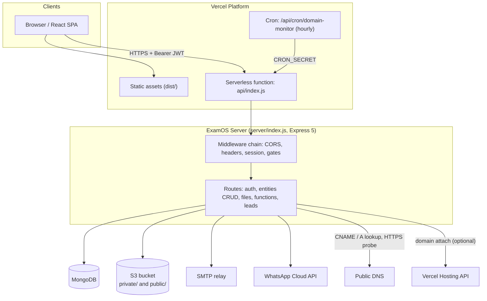

---

## 4. Runtime and Deployment

### 4.1 Two run modes, one codebase

*(Current)* The server behaves differently based on `process.env.VERCEL`:

- **Vercel (production):** `api/index.js` does `import app from "../server/index.js"` and re-exports it. `server/index.js` skips `app.listen` when `VERCEL` is set, so the function is invoked by the platform rather than bound to a port. `vercel.json` sets `maxDuration: 300` seconds and `memory: 1024` MB for `api/index.js`.
- **Local / self-hosted:** `npm run dev` runs `concurrently` over `node --watch server/index.js` (listens on `PORT || 3090`) and `vite`. `npm run server:start` runs the server alone.

*(Current)* `vercel.json` also declares:

- `buildCommand: npm run build`, `outputDirectory: dist` (the Vite build).
- `includeFiles: ["server/omr-engine/**/*.mjs", "server/omr-engine/templates/**/*.json", "node_modules/pdfjs-dist/legacy/build/pdf.worker.mjs"]` so the CV engine, its templates, and the pdf.js worker ship with the function. This **must stay an array**: Vercel expands each array entry as its own glob, so a single comma-joined string is one pattern containing a literal comma and silently matches nothing.
- `excludeFiles: "node_modules/pdfjs-dist/legacy/build/*.map"` — keeps ~7.8 MB of pdf.js source maps out of the bundle.

*(Current)* **`pdfjs-dist` tracing constraint.** pdf.js loads its worker at runtime via `await import(this.workerSrc)` (with `/*webpackIgnore: true*/` and `/*@vite-ignore*/`), and defaults `workerSrc` to the relative string `"./pdf.worker.mjs"`. Because the specifier is a runtime value, Vercel's node-file-trace cannot follow it, so `pdf.worker.mjs` is **not** bundled and every PDF OMR conversion fails on Vercel with `Setting up fake worker failed: "Cannot find module '.../pdf.worker.mjs'"`. `evaluator.mjs` therefore imports the worker itself with a literal specifier and publishes `globalThis.pdfjsWorker = { WorkerMessageHandler }` before calling `getDocument`; pdf.js checks that global in `PDFWorker._setupFakeWorkerGlobal` and skips its own dynamic import entirely. The explicit `includeFiles` entry is defence in depth. **A `pdfjs-dist` major upgrade may invalidate this and must be re-tested against a real PDF upload.**

*(Current)* `standardFontDataUrl` is deliberately **not** set on `getDocument`. pdf.js fetches standard fonts through the global `fetch`, which Node does not implement for `file:` URLs, so any local path passed here fails with `Unable to load font data` and silently falls back. pdf.js v5 also moved the assets from `pdfjs-dist/legacy/standard_fonts` to `pdfjs-dist/standard_fonts`. OMR sheets embed their fonts, so the fallback is lossless for this pipeline.
- `crons`: `/api/cron/domain-monitor` on `0 0 * * *` (daily, 00:00 UTC) and `/api/cron/affiliate-renewal-reminders` on `0 6 * * *` (daily, 06:00 UTC).
- `rewrites`: `/api/(.*)` → `/api`, and `/(.*)` → `/index.html` (SPA history fallback).
- Security headers on `/`, `/index.html`, and `/assets/(.*)`.

*(Current)* `.vercelignore` excludes `*.py`, `server/omr-engine/golden`, and the OMR `requirements.txt`, confirming the Python evaluator is not part of the deployed runtime.

*(Current)* A self-hosted domain monitor can be enabled with `DOMAIN_MONITOR_INTERVAL_MS` (minimum 60,000 ms). The interval is only registered when `VERCEL` is unset — on Vercel the `crons` block drives the same endpoint.

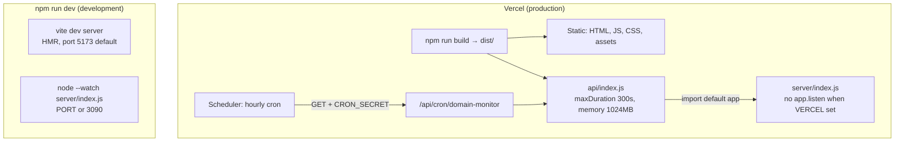

### 4.2 Build and quality commands

*(Current)* From `package.json`: `build` (Vite), `lint` (`eslint . --quiet`), `typecheck` (`tsc -p ./jsconfig.json`), `test` (`node --test server/test`), `test:rbac` (`node server/test-live/rbac-live.mjs`), `backfill:email-verified`. Node engine requirement is `>=20`; the project is ESM (`"type": "module"`).

*(Current)* There is no CI configuration. There is no `.github/` directory and no other workflow definition in the repository. `npm test` is a local command only.

---

## 5. Request Lifecycle

*(Current)* Middleware is installed in a fixed order in `server/index.js`. The order is load-bearing: the session must be hydrated before the gates can read `req.user`, and the first-login gate precedes the verification gate so an account that is both unverified and flagged for a password change is told to verify first.

1. `installApiLogging(app)` (`server/logger.js`) — attaches `req.requestId` (echoing a safe `X-Request-ID` or generating a UUID), sets the response header, and logs start/end lines with method, path, status, and duration.
2. `cors({ origin: corsOrigin, credentials: false })` — `corsOrigin` allows an origin only if it is in the `CLIENT_ORIGIN` allowlist. With `CLIENT_ORIGIN` unset, no cross-origin origin is allowed. There is no allow-all fallback.
3. `express.json({ limit: "25mb" })` and `express.urlencoded({ extended: true, limit: "25mb" })`.
4. A security-headers middleware setting `X-Content-Type-Options: nosniff`, `X-Frame-Options: DENY`, `Referrer-Policy: strict-origin-when-cross-origin`, and the CSP from `SECURITY_CSP`. HSTS is set only when `req.secure` or `X-Forwarded-Proto: https`, so local plain HTTP is unaffected.
5. `app.disable("x-powered-by")` is applied at app construction.
6. `GET /api/public/uploads/:filename` — the only unauthenticated asset route, for branding logos.
7. Session hydration: if an `Authorization: Bearer <jwt>` header is present, `getUserFromToken` verifies the JWT and **re-reads the `User` document from MongoDB on every request**.
8. First-login gate: a `student` or `parent` with `must_change_password === true` is refused everything except `FIRST_LOGIN_ALLOW` (`/api/auth/me`, `/api/auth/change-password`), with 403 and code `MUST_CHANGE_PASSWORD`.
9. Email-verification gate: if a session exists and `isEmailVerified(req.user)` is false, the request is refused with `EMAIL_UNVERIFIED_RESPONSE` unless the path is in `VERIFICATION_ALLOWED_PATHS`. The gate is allowlist-based, so a route added later is protected by default.
10. Route handlers, each wrapped by `route()`, which maps a Mongo `11000` duplicate-key error to 409 and any `err.statusCode` / `err.status` to the HTTP status.
11. Entity responses are serialized through `present()` → `redactSecrets()` / `redactTenant()` / `safeUser()`.
12. Mutations write an audit event through `logServerAudit`, which is best-effort and never throws.

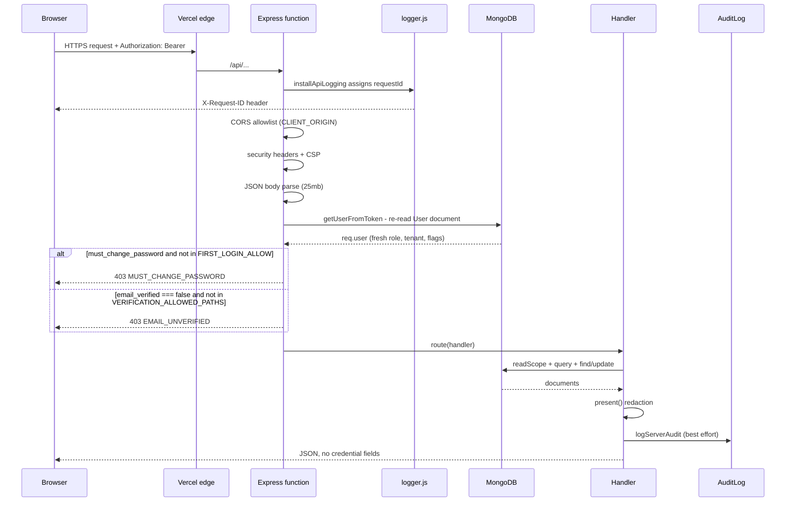

*(Current)* One consequence of step 7 is worth stating explicitly: because the JWT carries only a `userId` and the `User` document is re-read per request, a role change, a tenant move, or an `email_verified` flip takes effect on the very next request. There is no stale-token window for authorization state. There is also no revocation: see [§17.4](#174-not-currently-implemented-security-controls).

---

## 6. Frontend Architecture

### 6.1 Stack

*(Current)* React 18 + Vite 6, React Router 6, TanStack React Query 5, Radix UI primitives, Tailwind CSS 3, Lucide icons, Recharts, `jspdf` / `html2canvas` for client-side report generation, `@techstark/opencv-js` (WASM OpenCV) for client-side OMR helpers. See `package.json`.

### 6.2 Routing

*(Current)* `src/App.jsx` is 196 lines and declares every route. Routes are grouped into a public/marketing block, an auth block, a platform block, a tenant-staff block, family portals, `/checkout`, and a `*` catch-all rendering `PageNotFound`.

| Group | Paths |
|---|---|
| Marketing | `/`, `/pricing`, `/contact`, `/book-demo`, `/terms`, `/privacy` |
| Authentication | `/login`, `/s/:school`, `/s/:school/login`, `/portal/:school`, `/institute/:school`, `/register`, `/forgot-password`, `/reset-password`, `/verify-email`, `/change-password` |
| Platform | `/super-admin`, `/institutions`, `/tenants`, `/insights`, `/leads`, `/leads-management`, `/plans`, `/subscription-plans`, `/platform-branding`, `/employees` |
| Tenant staff | `/dashboard`, `/teacher-portal`, `/examinations`, `/examinations/:id`, `/students`, `/students/:id`, `/parents`, `/enrollments`, `/teachers`, `/academic-setup`, `/analytics`, `/staff`, `/billing`, `/white-label`, `/audit-logs`, `/performance`, `/attendance`, `/timetable`, `/assignments`, `/announcements` |
| Family | `/student-portal`, `/parent-portal` |
| Other | `/checkout`, `*` |

*(Current)* **No code splitting.** `rg "React.lazy|lazy(|import("` over `src/App.jsx` returns nothing: every page component is a static import. A visitor to the marketing landing page downloads the whole application bundle, including the platform console, the lead manager, the OMR camera scan dialog, and the PDF generators.

*(Current)* `/checkout` renders `src/pages/Checkout.jsx`, which is **not** a payment page: it resolves a `plan_id` from the query string via `publicSite {action: "plans"}` and calls `startFreeTrial`, displaying a 30-day trial activation confirmation with the post-trial price. It takes no payment. The `@stripe/react-stripe-js` and `@stripe/stripe-js` packages are declared as dependencies but imported nowhere in `src/` or `server/`. The `Payment` collection is written by seed data only — no role holds write access to it in `ENTITY_WRITE_ROLES`. See [§17.4](#174-not-currently-implemented-security-controls).

### 6.3 API client

*(Current)* `src/api/appClient.js` is the single browser→API seam. Key properties:

- The JWT is read from and written to `localStorage` under `avexora_examos_token` (`AUTH_TOKEN_KEY`).
- The base URL is `import.meta.env.VITE_API_URL || "/api"`.
- `entities` is a `Proxy` that generates a CRUD accessor for any collection name, so `appClient.entities.OMRSheet.filter(...)` targets `POST /api/entities/OMRSheet/filter`.
- `functions.invoke(name, data)` posts to `/api/functions/<name>` and unwraps the response into `{ data }`.
- `integrations.Core.UploadFile` builds a `FormData` request to `/api/upload`, and falls back to the impersonated school's id when the caller does not supply one.
- `viewAsHeaders()` attaches `X-View-As-Tenant` to **every** request while a `view as` record is present. It lives in `request()` — the one function all of the above pass through — so no call site has to remember it, and it reads the record through `@/lib/impersonation` rather than re-reading `sessionStorage`, keeping one owner for that key. `UploadFile` bypasses `request()` (it posts `FormData` so the browser can set the multipart boundary) and therefore sets the header itself; before this it was the one place that hand-rolled the impersonation read. See §10.8 for what the server does with it.
- `users.getAssignedTenants` / `setAssignedTenants` deliberately route through `POST /api/functions/manageStaff` rather than the entity API, because `assigned_tenant_ids` is treated as a server-secret field.

*(Current)* A non-2xx response throws `Object.assign(new Error(data.error), { status, data })`. The `data` payload is what `AuthContext` switches on to distinguish `NO_ASSIGNED_ROLE` from `EMAIL_UNVERIFIED`.

### 6.4 Authentication state machine

*(Current)* `src/lib/AuthContext.jsx` hydrates the user by calling `appClient.auth.me()` on mount and stores it in React state. On failure it branches:

| Server response | Client state | Token kept? |
|---|---|---|
| `NO_ASSIGNED_ROLE` | `authError.type = "no_assigned_role"` | yes |
| `EMAIL_UNVERIFIED` | `authError.type = "email_unverified"` (with `email`) | yes |
| `401` | `authError.type = "auth_required"` | no (removed) |
| any other error | `authError.type = "user_not_registered"` | no (removed) |

*(Current)* The two "keep the token" branches are deliberate and are explained in the source: the account is real and the user is stranded if the token is dropped, because `POST /api/auth/resend-verification` is an authenticated route — discarding the session would remove the only way to ask for another link.

*(Current)* `src/components/ProtectedRoute.jsx` renders, in order: a spinner while `isLoadingAuth || !authChecked`; the matching error component for each `authError.type`; the `unauthenticatedElement` prop when unauthenticated; an explicit `EmailUnverifiedError` branch when `user.email_verified === false` (needed because `/api/auth/me` is on the server's verification allowlist and answers 200 for an unverified account); and a `<Navigate to="/change-password">` redirect when `user.must_change_password === true`.

### 6.5 Role and permission mirrors

*(Current)* `src/lib/roles.js` mirrors the server role vocabulary: `APP_ROLES` (same 8 values as `server/rbac.js`), `PLATFORM_ROLES`, `TENANT_STAFF_ROLES`, `FAMILY_ROLES`, `EXAM_WORKFLOW_ROLES`, `isExamWorkflowRole`, `getAppRole`, `ROLE_LABELS`, and `ROLE_PORTAL` (post-login destination per role). `src/lib/permissions.js` provides `PAGE_ROLES` and per-action helpers consumed by `App.jsx` and `RoleGuard`.

*(Current)* The mirrors are hand-maintained. The server module's header comment names this exact failure mode: the previous arrangement had eight independent copies of the role definitions, and they had drifted. The consolidation moved the server side into one pure module; the client side remains a deliberate, documented mirror, with `src/lib/roles.js` stating the server check is the enforcement point.

*(Current)* `rolePortal(user)` returns `null` for an account with no recognized role rather than a fallback, because a fallback destination would be a role-gated route that redirects back to `/home`, looping.

### 6.6 Impersonation is a view overlay

*(Current)* `src/lib/impersonation.js` stores an impersonation record in `sessionStorage` under `avexora_view_as` and `applyImpersonation(user)` overlays `app_role`, `app_roles`, `tenant_id`, `linked_student_id`, `email`, and `full_name` onto the React user object. It is gated on the session holding the **exact** role `super_admin`, not the legacy `role` field. This is the one place in the app that asks "is this the platform owner" rather than "does the user hold a role that permits X": impersonation is a platform-owner power, so an account that merely *also* holds `super_admin` must not silently gain the ability to view as any tenant. The impersonated view is always a single role, and both `app_role` and `app_roles` are written so the two agree inside the overlay.

*(Current)* The overlay does not change what the API permits. `appClient` continues to send the real `super_admin` JWT, so every request beneath it still runs with full platform privileges. The module comment states this: "It is a rendering convenience, never a security boundary." Started from `src/pages/Tenants.jsx` and `src/pages/SuperAdminDashboard.jsx`, surfaced by `ImpersonationBanner`, and cleared on logout or by `stopImpersonation`.

*(Current)* `server/index.js` contains one accommodation for this overlay: in `previewExamRoster`, a platform admin viewing as a tenant has no `tenant_id` on the session token, so the tenant is derived from the selected `AcademicYear` document, which is tenant-owned, and `assertTenantOwnership` is applied to that document.

### 6.7 Custom-domain branding on the client

*(Current)* `src/hooks/useTenantDomain.js` treats any hostname that is not `localhost`, `127.0.0.1`, or a member of `PLATFORM_HOSTS` (from `src/lib/utils.js`) as a branding candidate. It calls `appClient.functions.invoke("publicSite", { action: "branding", school: host })` and caches the result in `sessionStorage` under `tenant-domain-branding:<host>`. A school's `*.avexora.in` portal subdomain is therefore branded on first paint.

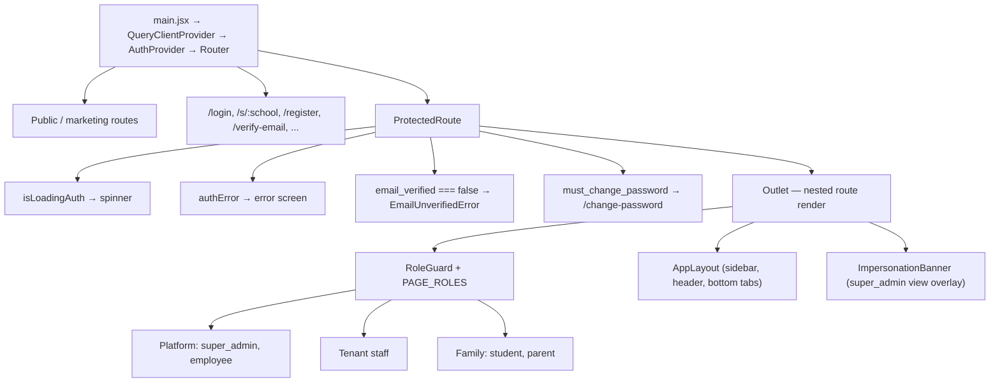

---

## 7. Backend Architecture

### 7.1 Module inventory

*(Current)* Everything under `server/` except the OMR engine is plain Node ESM with no framework beyond Express.

| Path | Responsibility |
|---|---|
| `server/index.js` | The entire HTTP surface: middleware, auth routes, generic entity CRUD, files, 23 backend functions, lead management, domain functions. 6,746 lines. |
| `server/rbac.js` | Pure authorization policy: roles, groups, entity write matrix, provisioning hierarchy, redaction field lists, query-operator allowlist, verification constants. No `req`, no `db`. |
| `server/crm-authorization.js` | Relationship authorization: `PRIVILEGED_TENANT_ROLES`, `CRM_SCOPED_ROLES`, `studentIdsForUser`, `teacherAssignmentIsValid`, `canAccess`. |
| `server/provisioning.js` | `provisionUser`, `provisionAutoLogins`, `safeUser`, `resolveDefaultStudentPassword`. Temporary credentials and safe serialization. |
| `server/rate-limit.js` | `RATE_LIMITS` table, `MemoryRateStore` / `MongoRateStore`, `getClientIp`, `tooMany`, `runLimit`. |
| `server/db.js` | `MongoClient` singleton, `db()`, `getClient()`. |
| `server/ensure-indexes.js` | 447 lines of idempotent index creation with duplicate preflight. **Not run at startup.** |
| `server/logger.js` | `installApiLogging`: request id, start/end console lines, duration, error capture. |
| `server/seed.js` | Development seed data across all major collections. |
| `server/academicSetupService.js` | `authorizeAcademicSetup`, `setupAcademicStructure`. |
| `server/attendanceService.js` | Attendance authorization and read/write, exam attendance, `reconcileExamAbsentees`. |
| `server/examRosterService.js` | Authoritative examination roster derivation and queries. |
| `server/examTimetableService.js` | Timetable reads with `revealExamMaterial` gating. |
| `server/identityResolver.js` | Admission-number identity resolution for OMR sheets. |
| `server/studentNumberService.js` | Admission and roll number allocation, tenant configuration. |
| `server/admissionNumberUtils.js` | Admission number canonicalization and formatting. |
| `server/lib/s3.js` | Storage abstraction: mode selection, key builders, object CRUD, `downloadToFile`. |
| `server/lib/domainGuard.js` | Subdomain normalization, reserved-word check, uniqueness guards. |
| `server/lib/domainVerifier.js` | DNS chain check and live HTTPS probe with typed failure reasons. |
| `server/lib/domainMonitor.js` | Periodic verification, `verifyCronToken`, alert building. |
| `server/lib/hosting.js` | Hosting provider registry and contract validation. |
| `server/lib/vercelProvider.js` | Optional Vercel domain-attach automation. |
| `server/lib/activationOrchestrator.js` | `ACTIVATION_STAGE` ordered pipeline: DNS gate → attach → verify → probe. |
| `server/lib/httpRetry.js` | Retry helper. |
| `server/services/emailService.js` | SMTP send, configuration resolution. |
| `server/services/whatsappService.js` | Text, template, media, interactive message types; API key verification. |
| `server/services/leadMessageService.js` | Lead communication history. |
| `server/services/leadNotificationService.js` | Lead notifications. |
| `server/services/leadSettingsService.js` | Lead settings persistence. |
| `server/services/integrationSettingsService.js` | Integration settings persistence. |
| `server/services/crypto.js` | `encryptSecret` / `decryptSecret` gated on `SETTINGS_ENC_KEY`. |
| `server/omr-engine/` | CV engine: `omr-runner.mjs`, `eval-worker.mjs`, `evaluator.mjs`, `opencv-loader.mjs`, `png-writer.mjs`, `generate-sample-omr.mjs`, 3 templates, 10 golden cases, and the non-deployed `evaluator.py`. |
| `shared/custom-domain.js` | Dependency-free hostname normalization, classification, and private-IP detection. Imported by both `src/` and `server/`. |

### 7.2 Concerns co-located in `server/index.js`

*(Current)* The file is internally sectioned by comment banners. Those banners are the most accurate map of the responsibilities it carries:

- SEC-03: secure uploads (magic bytes, size caps, layout)
- OMR Computer Vision engine configuration and helpers
- S3-aware OMR staging
- SEC-06: CORS allowlist and security headers
- Response redaction (SEC-07)
- User privilege-state guard
- Public uploads route, JWT helpers, session hydration, first-login and verification gates
- Custom domain verification; domain monitor (Phase 3)
- SEC-01: centralized RBAC wiring
- SEC-02: audit event integrity (`logServerAudit`, `CLIENT_AUDIT_EVENTS`, `SERVER_AUDIT_EVENTS`)
- Teacher exam scope
- Email verification
- Authentication routes
- Entity CRUD and file routes
- Lead management (super-admin only)
- Backend functions (`processOMRSheet`, `evaluateExamination`, domain functions, and the rest)
- Startup: storage init, index bootstrapping, hosting provider registration, `app.listen`

*(Current)* Several of the pure concerns that already live in separate modules (`rbac.js`, `crm-authorization.js`) are still imported into `index.js` and re-used from there. The extraction is partial by design: policy is already separate, orchestration is not.

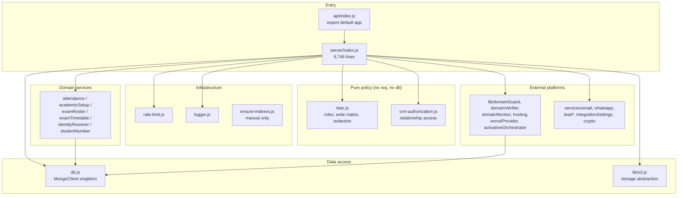

---

## 8. Authentication

### 8.1 Token model

*(Current)* `createToken(userId)` in `server/index.js` signs `{ userId }` with `JWT_SECRET` and a **7-day** expiry. `getUserFromToken` verifies the signature and then loads the `User` document by `ObjectId`. A missing `JWT_SECRET` causes `process.exit(1)` at startup with a console error, rather than a degraded run.

*(Current)* Passwords are hashed with bcrypt at cost 10 (`hashPassword`), compared with `verifyPassword`. Reset tokens and email-verification tokens are stored as SHA-256 hashes (`crypto.createHash("sha256").update(token).digest("hex")`), so the plaintext token exists only in transit. TTLs: `RESET_TOKEN_EXPIRY_MS` = 1 hour; `VERIFICATION_TOKEN_EXPIRY_MS` = 24 hours (longer deliberately, so the address is still reachable when the user gets to the link).

*(Current)* Tokens are **not** refreshed or rotated, and there is no server-side deny-list. Because the user document is re-read on every request, a disabled or role-stripped account loses access immediately; but a token for a user who was deleted from the `User` collection resolves to `null` and the request is treated as anonymous. There is no explicit logout invalidation beyond removing the client-side copy.

### 8.2 Registration

*(Current)* `POST /api/auth/register` (public, rate-limited to 10 per IP per 15 minutes via `RATE_LIMITS.register`):

- Requires `email` and `password`; normalizes the email to lowercase and rejects a duplicate with 409.
- **Never assigns a platform role.** `assignedAppRole` is hard-coded to `"school_admin"` and `assignedRole` to `"user"`. The source comment states the earlier `countUsers === 0` first-registrant promotion to `super_admin` has been removed, and that the env-driven `ADMIN_EMAIL` / `ADMIN_PASSWORD` bootstrap is the authoritative way a `super_admin` account is created.
- Creates a `Tenant` alongside the account, with `status: "active"`, `white_label_enabled: true`, and a `subdomain` produced by `normalizeSubdomain(school_name || email local part)`, then validates it with `assertSubdomainUsable` and `assertSubdomainAvailable`. The comment explains why: the subdomain is a public tenant identifier resolved by the branding lookup, so a blind slug could be empty or collide with a real institution, letting a registrant shadow a school's portal.
- Creates the user with `email_verified: false` and the new `tenant_id`.
- Issues a verification token best-effort: a mail failure logs a warning and does not discard the registration, because the user can request a resend from the verify screen.
- Writes an audit event with a **server-derived actor** built from the document just inserted, not from `req.body`.
- Returns a live token, plus `email_verified: false` and `verification_required: true` so the client routes to the verify screen instead of inferring the state from a later 403.

### 8.3 Login

*(Current)* `POST /api/auth/login` accepts an email **or** a non-email identifier:

- With `tenant_id` or `school`, a `Tenant` is resolved first (by id, or by a regex over `subdomain` / `custom_domain` / `name` with escaped input and surrounding-whitespace tolerance). A failed resolution is 403 "Institution not found".
- A non-email identifier (roll number or admission number) **requires** a resolved tenant; without one the response is 400 with an explicit message to use the school's portal URL.
- Rate limiting runs **before** any bcrypt work. The failure key is the composite `(tenantId, identifier, ip)`, deliberately so one hostile IP cannot permanently lock a shared account while the per-IP aggregate still bounds distributed spraying. Budgets: `loginFail` 10 / 15 min per composite key, `loginIpFail` 100 / 15 min per IP, `loginLockout` 30 min.
- `POST /api/auth/login` returns a 7-day token.

### 8.4 `GET /api/auth/me`

*(Current)* Requires a session. Validates `app_role` against `VALID_APP_ROLES`; an unrecognized or missing role returns 403 with code `NO_ASSIGNED_ROLE`, a `uid`, the email, and `app_role: null`. The source comment records the regression this replaced: defaulting to `school_admin` handed a role-less account the full school-admin sidebar and routes while the API layer denied every action. The response includes `email_verified` normalized to a real boolean, matching the gate's own "absence means verified" default.

### 8.5 The two global gates

*(Current)* Both are `app.use` middlewares placed after session hydration, and both are allowlist-based so that a route added later is protected by default:

| Gate | Condition | Exempt | Response |
|---|---|---|---|
| First-login | `app_role ∈ {student, parent}` and `must_change_password === true` | `FIRST_LOGIN_ALLOW` = `/api/auth/me`, `/api/auth/change-password` | 403 `MUST_CHANGE_PASSWORD` |
| Email verification | session exists and `isEmailVerified(req.user)` is false | `VERIFICATION_ALLOWED_PATHS` | `EMAIL_UNVERIFIED_RESPONSE` (403), with `code` and `email` |

*(Current)* `isEmailVerified` treats only an explicit `email_verified: false` as unverified; absence means verified. `server/test/rbac.test.mjs` asserts that the verification exemption list is explicit, minimal, and closed, and that verification is orthogonal to role — it withholds access, it never grants it.

### 8.6 Other auth routes

*(Current)* `POST /api/auth/reset-password-request` (budgets: 5/hour per email, 20/hour per IP), `POST /api/auth/reset-password` (30/hour per IP), `POST /api/auth/verify-email`, `POST /api/auth/resend-verification` (5/hour per user, 30/hour per IP, with a documented rationale distinguishing inbox-flooding from token-guessing), `POST /api/auth/change-password` (20/15min per IP).

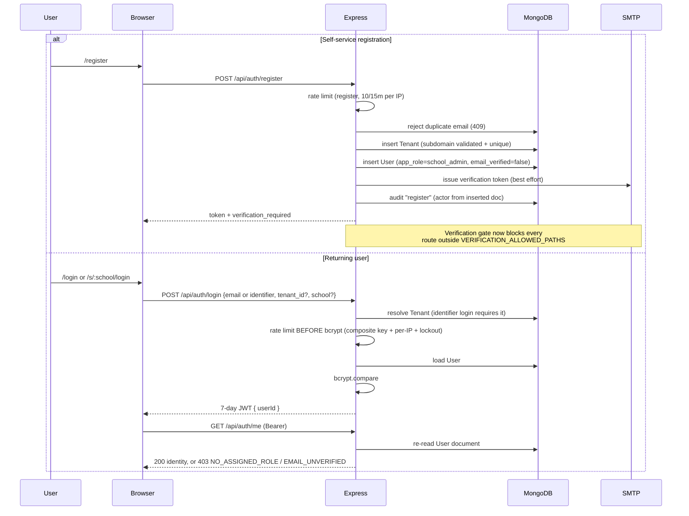

---

## 9. Authorization and RBAC

*(Current)* All role policy lives in `server/rbac.js`, which is deliberately pure: it takes a user object and returns a decision, and never touches the request, the response, or the database. The module's own header records why — the previous arrangement had eight independent copies of the role definitions that had already drifted.

### 9.1 Authorization order

The order stated in the module header, and implemented as such in `server/index.js`:

```
authentication → tenant boundary → role authorization → resource scope
```

### 9.2 Role vocabulary and groups

*(Current)* `APP_ROLES` defines exactly eight roles. `server/test/rbac.test.mjs` asserts the count and that the groups partition sensibly without unexpected overlap.

| Role | Group membership |
|---|---|
| `super_admin` | `PLATFORM_ROLES`, `EXAM_WORKFLOW_ROLES` (implicitly, via `isExamWorkflow`), `EXAM_MATERIAL_ROLES`, provisioning root |
| `employee` | `PLATFORM_ROLES`, `EXAM_MATERIAL_ROLES`, provisions nobody |
| `school_admin` | `EXAM_WORKFLOW_ROLES`, `STAFF_ROLES`, `EXAM_MATERIAL_ROLES` |
| `principal` | `EXAM_WORKFLOW_ROLES`, `STAFF_ROLES`, `EXAM_MATERIAL_ROLES` |
| `exam_coordinator` | `EXAM_WORKFLOW_ROLES`, `STAFF_ROLES`, `EXAM_MATERIAL_ROLES` |
| `teacher` | `STAFF_ROLES`, `EXAM_MATERIAL_ROLES` |
| `student` | `FAMILY_ROLES` |
| `parent` | `FAMILY_ROLES` |

*(Current)* Actor predicates, and the question each one answers:

| Predicate | Answers | Reads |
|---|---|---|
| `rolesOf(req)` | every role held | `app_roles` (canonical) |
| `roleOf(req)` | the **scope** identity | the primary role |
| `hasAnyRole` / `hasRole` | "does the union permit X" | the full set |
| `isSuperAdmin(req)` | "is this the platform owner" | the full set |
| `isPlatform(req)` | "is this a platform role" | the full set |
| `isExamWorkflow(req)` | "is this an exam-workflow role" | the full set |

`super_admin` is the implicit unrestricted platform owner for every check. Note that the capability predicates and `roleOf` deliberately disagree about which field they read: that split **is** the multi-role model (union to authorize, primary to scope) and is covered by tests on both sides.

### 9.2a Rolling out `app_roles`

*(Current)* The application does **not** require the backfill to have run. `appRolesOf()` falls back to the single `app_role` when the array is absent or empty, which is what makes the deploy order safe.

`server/backfill-app-roles.js` makes the rollout state explicit instead, so a later migration does not have to reason about documents whose meaning depends on a field being absent:

- **Dry run by default.** `--apply` is required to write anything.
- Only documents whose `app_roles` is missing or empty are touched. An existing non-empty array is **never** overwritten — it is canonical.
- An account with no recognizable role is left alone and **reported**. It is already locked out by the `NO_ASSIGNED_ROLE` gate; inventing a role would hand out access nobody granted.
- Two classes of mirror disagreement are handled differently. An **unrecognized** `app_role` is repaired to the array's primary: there is no second reading of a value the policy does not define. A `app_role` that **is** a valid role but is not the primary is only **reported**, never rewritten — both fields are well-formed, so nothing looks broken, but which of two valid answers is intended is a human decision. This second class cannot be expressed as a query, because the primary role is the highest-precedence *element* of the array rather than a fixed field, so the script walks the cursor in projection-only batches and compares in JS.

Usage: `npm run backfill:app-roles` (report) or `node server/backfill-app-roles.js --apply` (write).

### 9.3 Entity write matrix

*(Current)* `ENTITY_WRITE_ROLES` maps each of the 27 generic-entity collections to per-verb role allowlists. An empty array means only `super_admin` may write. The full matrix, as declared:

| Entity | create | update | delete |
|---|---|---|---|
| AcademicYear | school_admin | school_admin | school_admin |
| Announcement | — | — | — |
| AnswerKey | school_admin, exam_coordinator, teacher | school_admin, exam_coordinator, teacher | school_admin, exam_coordinator |
| Assignment | school_admin, principal, exam_coordinator, teacher | same | school_admin, teacher |
| AssignmentSubmission | school_admin, teacher, student | school_admin, teacher, student | school_admin |
| Attendance | school_admin, principal, exam_coordinator, teacher | same | school_admin |
| AuditLog | — | — | — |
| Enrollment | school_admin, exam_coordinator | school_admin, exam_coordinator | school_admin |
| Examination | school_admin, principal, exam_coordinator, teacher | same | school_admin |
| Lead | — | — | — |
| OMRCorrection | school_admin, principal, exam_coordinator | — | — |
| OMRSheet | school_admin, principal, exam_coordinator | same | school_admin |
| Parent | school_admin | school_admin | school_admin |
| ParentStudent | school_admin | school_admin | school_admin |
| Payment | — | — | — |
| PlatformBranding | — | — | — |
| Result | school_admin, principal, exam_coordinator | same | school_admin |
| SchoolClass | school_admin | school_admin | school_admin |
| Section | school_admin | school_admin | school_admin |
| Student | school_admin, exam_coordinator | school_admin, exam_coordinator | school_admin |
| Subject | school_admin, principal, exam_coordinator, teacher | school_admin | school_admin |
| SubscriptionPlan | — | — | — |
| Teacher | school_admin | school_admin | school_admin |
| TeacherAssignment | school_admin | school_admin | school_admin |
| Tenant | — | school_admin | — |
| TenantAnnouncement | school_admin | school_admin | school_admin |
| User | — | — | — |

*(Current)* `canWriteEntity(req, name, action)` **fails closed**: an entity or verb with no matrix entry is not writable by anyone but `super_admin`. `AuditLog` is refused outright, even for `super_admin`, because audit events are created only by the server-side `logServerAudit`, never through generic CRUD.

*(Current)* `User` has empty allowlists on purpose. Accounts are created by `provisionUser()` and roles changed by `assignUserRole()`, both of which enforce the delegation matrix and write an audit event. Generic entity CRUD is not a path to a privilege change.

### 9.4 Second write gate: tenant context

*(Current)* `writeAllowed(req, name, data)` in `server/index.js` is a second, independent guard on the write path. `super_admin` passes. `Tenant` and `TenantAnnouncement` require the caller to have a `tenant_id` and the body to carry either no `tenant_id` or their own. Every other entity additionally requires that the name is neither in `globalOnly` nor in `publicRead`. So the effective write rule is the intersection of *which roles may write this entity* and *whose tenant this write lands in*.

### 9.5 Privilege-state guard

*(Current)* `userPrivilegeWriteRefused(update, ...)` is applied on **every** User write route — single PATCH, bulk PATCH, `/many` PATCH, and `/many` DELETE — so the invariant cannot be enforced on one route and forgotten on another. It refuses:

- Any field in `SECRET_ENTITY_FIELDS` (`password_hash`, `reset_password_token`, `reset_password_expires_at`, `invite_token`, `invite_expires_at`, `email_verification_token`, `email_verification_expires_at`, `student_default_password`).
- `email_verified` — the activation switch the global gate reads on every request; written only by the token verification endpoint.
- A legacy `role` write, or a `tenant_id` move, outright. A body may carry exactly one privilege field (`app_role`, routed through `assignUserRole`); pairing it with a legacy role or a tenant is refused rather than quietly dropped, so a caller that asked to move an account cannot receive 200 while its `tenant_id` never moves.

*(Current)* `assertFlatUpdateBody` additionally refuses a single-record PATCH body shaped as a wrapper (`update`, `$set`, `$unset`, `$push`, `$pull`, `$addToSet`) or containing any `$`-prefixed key. The comment explains the concrete bypass this closes: a body of `{update: {app_role: "super_admin"}}` matched no guarded key and would have been written as a literal `update` subdocument.

### 9.6 The multi-role model

*(Current)* An account may hold **several** roles at once. The motivating case is one person who teaches and also runs the examination workflow — one person doing two jobs in one school, not two accounts.

`app_roles` is the **canonical** field. `app_role` is retained as a **mirror of the primary role**, not as an independent input. Two rules govern what a set means, and keeping them separate is what stops the feature from becoming a privilege escalation:

- **CAPABILITY is the UNION.** "May this actor do X" is answered by any held role that authorizes X. `canWriteEntity`, `canUploadPurpose`, `canReadAuditLog`, `canExtractRoster`, `canStartTrial`, `hasAnyRole`, `canStartTrial` and the `manageStaff` route gate (`canManageStaff`) all answer over the full set. Reading the primary role there would strip capabilities from the second role, which is the opposite of what holding two roles is for.
- **SCOPE is the PRIMARY role.** A role that narrows an actor to its own resources applies only to an account whose *primary* role is that role. `readScope`, `teacherRosterScope` and the `Student`/`ParentStudent` boundary all test `roleOf(req)`, so a teacher who is primarily an `exam_coordinator` is not held to the class-assignment ceiling of the teaching job they also do.

`APP_ROLE_PRECEDENCE` is `super_admin > school_admin > principal > exam_coordinator > teacher > employee > student > parent`. The **primary role is the most privileged held role**, so "widest role" and "primary role" are the same answer for the tenant-staff group, and precedence is also what decides which portal a multi-role account lands on: `teacher + exam_coordinator` resolves to `exam_coordinator`, hence the exam console, not the teacher portal.

`ROLE_GROUPS` are the three mutually exclusive families: `PLATFORM_ROLES` (`super_admin`, `employee`), `STAFF_ROLES` (`school_admin`, `principal`, `exam_coordinator`, `teacher`) and `FAMILY_ROLES` (`student`, `parent`). `validateAppRoleSet` allows any combination **inside** one family and refuses every cross-family one (400).

The load-bearing refusal is a **family role never coexisting with a staff or platform role**. A student who is also a school administrator is not a student with extra powers, it is an administrator browsing a portal — and every own-record-only check is written on the assumption that the actor is nobody else. Mixing would let one account hold the narrowest and the widest read in the system simultaneously, and no screen legitimately needs it. A parent who is also a student stays inside `FAMILY`; a teacher who coordinates exams stays inside the staff group.

`appRolesOf(user)` falls back to the single `app_role` when the array is missing **or empty**. That fallback is what makes the deploy order safe: an account the backfill has not reached yet authorizes exactly as it did the day before rather than silently losing every role. An unrecognized value is **dropped**, never passed through, so a stale or hand-edited string cannot become an entitlement.

### 9.7 Role assignment

*(Current)* `assignUserRoles(req, { user_id, app_roles })` is the **single** place a privilege change is enforced. It is reached by `manageStaff {action:"setRoles"}`, the legacy `manageStaff {action:"setRole"}` and `assignUserRole(req, {user_id, app_role})` alias, and the generic `PATCH /api/entities/User/:id` route. Those two route families used to disagree — `setRole` enforced the hierarchy and audited, while the generic PATCH did neither and was reachable by `super_admin` alone (`ENTITY_WRITE_ROLES.User.update` is `[]`) — so a role could be minted or self-demoted through a route that contradicted the audited one and left no trace.

The gates run in this order, and the ordering is deliberate:

1. **Shape** — `validateAppRoleSet` (400). Empty and wholly unrecognized requests are 400, not a silent no-op. No DB, so nothing is learned.
2. **Target** — the account must exist (404).
3. **Tenant boundary** — a non-`super_admin` caller must match the target's `tenant_id`, else **404**.
4. **Delegation** — `canAssignRoleSet` over `ROLE_ASSIGNMENT_HIERARCHY` (403), skipped for `super_admin`.
5. **Role/tenant pairing** — a tenant role needs an institution (400).
6. **Last-administrator invariant** (400) — see below.
7. Write, then audit.

Step 3 before step 4 matters: if the delegation check ran first, the 403-vs-404 difference would tell a caller whether its own authority was insufficient *for that specific target* — a free cross-tenant signal. Answering 404 first makes the reply identical whether the account is absent, belongs to another school, or exists and the caller simply was not allowed.

Write-then-audit, not audit-then-write: a failed mutation after the audit row leaves a phantom log entry, whereas a failed audit after the mutation leaves an **unlogged change**. The latter is the worse failure.

- `super_admin` may assign any role, including the platform roles the matrix never grants. Every other actor is bound by `ROLE_ASSIGNMENT_HIERARCHY`, and `canAssignRoleSet` checks **every** requested role rather than only the primary. Within the current hierarchy every authorized set is downward-closed by precedence, so a primary-only check would produce the same answers — but that is a property of the present table, not of the rule, and it would stop holding the moment a hierarchy gains a branch.
- Writes `app_roles` and `app_role` **in the same `$set`**, so the two can never disagree and there is no separate "sync the mirror" step to forget. Also writes `tenant_id` for the primary role: a platform role gets `null`, a tenant role requires an existing `tenant_id` or returns 400. Writing either without its counterpart leaves an account that can authenticate but can never reach an institution's data.
- Writes an `assign_role` audit event.

#### Two matrices: minting is not re-labelling

`PROVISIONING_HIERARCHY` (minting) and `ROLE_ASSIGNMENT_HIERARCHY` (re-labelling) are **derived from each other** — the assignment matrix is the minting matrix plus a role's own level for `super_admin` and `school_admin` — so they cannot drift, and the only intentional difference is visible in one place. `principal` gets **no** own level, which is what stops a principal promoting a peer to principal or administrator.

| Action | Matrix | Can a school_admin make a `school_admin`? |
|---|---|---|
| `manageStaff setRole` / `setRoles`, `User` PATCH | assignment | **Yes** — the account already exists |
| `provisionUser`, `/users/invite`, `manageStaff invite` | minting | **No** — only the platform |

This is the load-bearing distinction of the whole screen. Promoting a colleague hands an administrator role to someone **already vetted and already holding a login**, so it is the school's own staffing decision. Minting creates a fresh credential for a new identity, which is exactly what a compromised administrator account would use to plant a backdoor that survives the real administrator's removal. So creating one is a platform action and the refusal message says so, naming the remedy — an unexplained 403 here reads as a missing feature rather than a decision.

The rule that selects the matrix is: **an action that can create an identity uses the minting matrix; an action that can only re-label an existing one uses the assignment matrix.** `manageStaff invite` updates an existing account when the email matches, but it is still an invitation, its UI surface is the create form (authorized by `creatable_roles`, never offered `school_admin`), and promoting someone who exists is `setRoles`.

*(Current)* `PROVISIONING_HIERARCHY`: `super_admin` → `school_admin`, `principal`, `exam_coordinator`, `teacher`; `school_admin` → `principal`, `exam_coordinator`, `teacher`, `student`, `parent`; `principal` → `exam_coordinator`, `teacher`, `student`, `parent`; `exam_coordinator` → `student`, `parent`; `teacher`, `student`, `parent`, `employee` → nobody. `canProvisionRole` returns `false` for a missing role rather than defaulting.

#### The last-administrator invariant

Stripping `school_admin` is **permitted** — a school may genuinely stand a colleague down — and it stays reversible, because a school_admin may promote an existing account back. What is *not* reversible from inside the school is ending up with nobody: an institution with no administrator cannot manage its own staff, billing or branding, and minting a replacement is a platform action, so the school would have to ask for one. `assignUserRoles` therefore refuses (400) any change that would leave a school with zero administrators, by counting *other* `school_admin` accounts in the tenant (`countTenantAdmins`, whose query reproduces the same legacy `app_role` fallback as `appRolesOf()` so a pre-migration administrator is not missed).

The guard applies to **every** caller, `super_admin` included: they can simply promote someone first, and one uniform rule is easier to reason about than a special case that exempts whichever actor happens to be logged in. It also adds a `countDocuments` only on the branch that removes `school_admin`, leaving the common path untouched.

The same invariant is enforced on **`deleteMyAccount`**. Role demotion and account deletion are two different routes to the identical dead end, so guarding only one would leave it enforced in name only — `canDeleteOwnAccount` is only `!isPlatform(req)`, so an institution's sole administrator could otherwise simply close their own login and orphan the school.

`super_admin`'s row is the platform owner's full tenant-staff reach, spelled out in the matrix rather than left to a bypass per caller. The creation paths used to disagree: `assignUserRole` exempted `super_admin` outright while `provisionUser`, `/users/invite` and `manageStaff invite` all called `canProvisionRole` unconditionally. That disagreement is what left the `/staff` screen offering a `super_admin` a single option — "School Administrator" — which then failed on submit regardless, because the screen posted no `tenant_id`. One matrix, no bypasses.

*(Current)* `staffCreatableRoles(creatorRole)` — the roles the `/staff` screen offers to create. It is the hierarchy entry minus `FAMILY_ROLES` **and** minus `school_admin`: `super_admin` → `principal`, `exam_coordinator`, `teacher`; `school_admin` → `principal`, `exam_coordinator`, `teacher`; `principal` → `exam_coordinator`, `teacher`; every other role → `[]`.

The screen and the hierarchy are deliberately different questions and must not be collapsed. The hierarchy answers "may this actor mint this account at all", and it **has to keep** `student` and `parent`: admitting a Student auto-provisions a portal login via `provisionAutoLogins()`, which gates on `canProvisionRole(creatorRole, "student"/"parent")` and runs on every Student creation. Trimming those two out of the hierarchy to tidy the staff screen would silently break student and parent portal onboarding for `school_admin`, `principal` and `exam_coordinator`. The `/staff` screen asks a different question — a human picking an account type from a dropdown — and excludes two things the hierarchy keeps:

- **`FAMILY_ROLES`** — a family portal login is never created there. It arrives as a side effect of admitting a student and is managed on the Students and Parents pages.
- **`school_admin`** — an institution's first administrator is minted by the flow that creates the institution (registration, or a platform trial), not off a staff dropdown. `startFreeTrial` is not a substitute: it self-promotes the caller and requires the caller to hold no tenant, so running it would convert the platform admin into a school administrator.

Deriving the screen by subtraction keeps the two answers from drifting, and a test asserts the excluded roles can never reappear on it.

**Creating** an account and **re-labelling** an existing one are two separate questions with two separate answers, so the screen answers both. `manageStaff {action:"list"}` returns three lists and the resolved `tenant_id` alongside `staff`, so the client renders the server's policy rather than a copy of it: `creatable_roles` (`staffCreatableRoles`, above) drives the invite form, and `assignable_roles` (`staffAssignableRolesFor`, the assignment matrix minus `FAMILY_ROLES`) drives the per-row role control. The `/staff` page previously held its own `PERMITTED_CREATION_ROLES` map, which had drifted from `PROVISIONING_HIERARCHY`: it omitted `exam_coordinator` from every parent's list and offered `exam_coordinator` only `["student","parent"]`.

The per-row control is what finally makes a school's *second* administrator reachable from a screen — the missing UI noted above. It offers `school_admin` to a `school_admin` (the assignment matrix grants it) while the invite form does not (the minting matrix does not), so the promotion path is visible exactly where the minting path is not. An administrator who can promote a colleague has a route out of a mistake, which is also what makes demotion (§9.7) safe to leave permitted rather than locked.

The list is a **staff** list, not a user list, and this is a narrowing with two deliberate asymmetries:

- Family logins are **excluded** (the query filters on `STAFF_ROLES` rather than merely dropping them client-side). They arrive as a side effect of admitting a student, are managed on the Students and Parents pages, and `validateAppRoleSet` refuses any set mixing them with a staff role — so an administrator could not have acted on the row anyway.
- An account with **no valid role** is **kept**. It is locked out by the `NO_ASSIGNED_ROLE` gate on every authenticated route, and this table is the only place it can be given a role, so filtering it away would make an unrecoverable orphan. The screen renders it in a separate **Unassigned** group, and a group of exactly one thing is most likely to be a bug report — showing it empty, or hiding it, is how a school gets stranded.

*(Current)* `resolveStaffTenant(req, requestedTenantId)` → `{ tenantId, error }` resolves the institution for every staff-management call (`manageStaff list` and `invite`, `/users/invite`), so the list and the writes can never target different schools.

A `super_admin` with no `tenant_id` supplied gets `null`, which means "every tenant" — a real, entitled read that the institutions console depends on and that `/staff` must never fall into by accident. Two guards keep it deliberate. The page sends **no** request until an institution is chosen, showing the empty state it already had wording for; a platform-wide view is one labelled click away, and picking a school cancels it. (Before this, `loading` started `true` and was only cleared inside `load()`, so a platform owner who had not yet picked spun forever, and `changeRoles` reloaded with a bare `load()` — firing exactly the unscoped call.) And while a `view as` scope is active (§10.8) the scope, not this function, is what bounds the answer.

It is pure and does no I/O, so it can only tell whether the actor is *allowed* to act in an institution — never whether the id **resolves**. Every caller must therefore confirm the named institution is real and active before reading or writing under it, and all three paths now do: the id must parse as an ObjectId, the `Tenant` must exist (**404** otherwise), and it must not be disabled (**400** otherwise — the same distinction `provisionUser` draws). Without this, a well-formed but meaningless id would have staff listed under it, or worse, have a role written onto an account bound to an institution that can never be administered again.

- `super_admin` may act in any institution, which is why `/staff` gives it a picker of active institutions. With no `tenant_id` supplied it falls back to its own (normally none) and a `null` result means "no scoping" — the platform-wide read the institutions console already depends on.
- Every other role is pinned to its own `tenant_id`; a mismatched value is **refused 404** rather than silently ignored, matching `assignUserRole`, so the answer never confirms that another institution exists. An account with no institution is refused 403 and naming one does not rescue it.
- Both invite paths then **refuse to create a tenant-less account for any tenant role** (400). This was a live defect: `super_admin` has no institution of its own, so `tenant_id: req.user?.tenant_id || null` wrote `null` and the invited account could authenticate but never reach a school's data — the same role/tenant pairing `assignUserRole` refuses to write.

*(Current)* `/staff` is reachable by `super_admin`, `school_admin` and `principal` — gated by `PAGE_ROLES.staffManagement` (`src/lib/permissions.js`), and the server independently authorizes the same three via `canManageStaff(req)` = `hasAnyRole(req, STAFF_MANAGE_ROLES)` over `super_admin`, `school_admin`, `principal`. `PERMISSIONS.manage_staff` states the same trio. **Reaching the screen is not the same as holding any authority in it:** a principal sees a working Staff Access page and `assignable_roles` of `["exam_coordinator", "teacher"]`, and is refused (403) a peer principal and any administrator by `canAssignRoleSet`. `B17d` still pins `exam_coordinator` to 403, and `C10` was **inverted** — it asserted a principal was refused, and now asserts it is admitted, with `C10b`/`C10c` covering the authority and cross-tenant limits inside.

`canManageStaff` is a named function rather than an inline union at the route so that the client (`PERMISSIONS.manage_staff`) and the server can be read against the same three-role list; a re-used `canWriteEntity` check that happened to have the right answer would be a coincidence, and one that drifted would fail closed on the server only, which is the safe direction but a slow way to find out. `manage_billing` stays `["super_admin", "school_admin"]`: a principal staffs a school, a school's subscription is its owner's business. Note that `PAGE_ROLES.staff` is a *different* group despite the name: it guards `/dashboard`, `/teacher-portal` and `/examinations`, not `/staff`. Because `/dashboard` is reachable by `principal`, `exam_coordinator` and `teacher`, `SchoolDashboard.jsx` gates its quick-nav links on capability rather than role — `/staff` on `manage_staff`, `/billing` on `manage_billing`; ungated, they dead-ended on a redirect to `/home`. The two are separate keys precisely so that admitting a principal to Staff Access did not also admit them to Billing (`PAGE_ROLES.schoolAdmin` still guards the billing and branding pages themselves).

### 9.8 Resource-scoped capabilities

*(Current)* Several capabilities are authorized independently of the page that rendered the control:

| Function | Rule | Rationale from source |
|---|---|---|
| `canUploadPurpose` | `logo` → super_admin, school_admin. `import` → super_admin, school_admin, exam_coordinator. `omr` → super_admin, school_admin, principal, exam_coordinator. | Each set mirrors the write permission the upload feeds. An unknown purpose is denied **before** the `super_admin` bypass, so a short-circuit cannot authorize a purpose the policy has no rule for. |
| `canExtractRoster` | super_admin, school_admin, exam_coordinator | Mirrors `ENTITY_WRITE_ROLES.Student.create` — the integration only previews what a permitted creator could import. |
| `canStartTrial` | super_admin, employee | Starting a trial mints a Tenant and self-promotes the caller. |
| `canDeleteOwnAccount` | everyone except platform roles | Platform operators are removed through the admin surface. |
| `canReadAuditLog` | platform roles, school_admin | Other roles get no audit read access. |
| `EXAM_MATERIAL_ROLES` | platform + exam-workflow + teacher | Exam material is content, not schedule data; a family role sees the date sheet only. |

### 9.9 Response redaction

*(Current)* `readScope()` is a **read filter, not a field filter**, and it is a no-op for platform roles. Without field-level redaction an `employee` could read every tenant's `password_hash`. So every entity response goes through `present(name, doc, req)`:

- `Tenant` → `redactTenant(out(doc), req)`, an **allowlist**: `_id`/`id` plus `TENANT_PUBLIC_FIELDS`, plus `TENANT_ADMIN_FIELDS` (`student_default_password`) only for `super_admin` and `school_admin` — the roles that may write it, since read access never exceeds write access on a credential.
- `User` → `safeUser()` → `redactSecrets()`, stripping all eight `SECRET_ENTITY_FIELDS`.
- Everything else → `redactSecrets(out(doc))`.

*(Current)* `redactTenant` is allowlist-based rather than denylist-based, so a new operational field on `Tenant` is not readable until explicitly added. `server/test/rbac.test.mjs` asserts the allowlist property, that `TENANT_BRANDING_FIELDS` is a strict secret-free subset of `TENANT_PUBLIC_FIELDS`, and that redaction order matters (Tenant must be redacted from the intact document, because stripping secrets first would delete the one credential the configuring administrator is entitled to read back).

### 9.10 Client query safety

*(Current)* `CLIENT_QUERY_OPERATORS = new Set(["$eq", "$in", "$ne"])` and `isSafeQueryValue(value)` gate every client filter through `query()`. A client-supplied `$or`, `$where`, or `$regex` is **dropped** rather than passed through, so it can never widen a scoped predicate. Only `id` is coerced to an `ObjectId`; every other value must pass `isSafeQueryValue`. `server/test/rbac.test.mjs` asserts that client filters may use equality but never Mongo operators.

### 9.11 Teacher scope

*(Current)* A teacher is resolved by `user_id` or normalized email within their own `tenant_id` and `status: "active"`. Their class set is the **union** of the denormalized `assigned_class_ids` on the profile and every live `TeacherAssignment` row's `school_class_id`. The union is deliberate: a teacher assigned purely through an assignment row must not fail a write check they legitimately pass on reads. The source states the invariant: the read predicate and the write guard resolve scope through the same helpers, so a teacher can never read something they are forbidden to write, or vice versa.

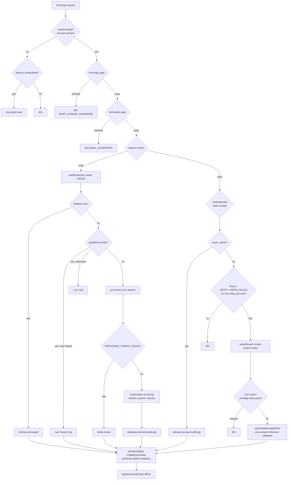

---

## 10. Multi-Tenancy and the Tenant Boundary

### 10.1 The model

*(Current)* Multi-tenancy is a **shared-collection, `tenant_id`-scoped document** model. Every tenant-owned collection carries a `tenant_id` field. Tenant identity is established by the session, never by a client-supplied parameter, with one narrow exception (see 10.5).

### 10.2 Entity classification

*(Current)* Two sets in `server/index.js` classify the 27 generic entities:

- `publicRead = { Announcement, PlatformBranding, SubscriptionPlan }` — readable without a session.
- `globalOnly = { Lead, Payment, Tenant, User }` — platform-scoped, not tenant-scoped.

*(Current)* `col(name)` rejects any name outside the 27-entry `allowed` set with 404 "Unknown resource". A collection cannot be reached by naming it, only by being in the allowlist.

### 10.3 `readScope` decision order

*(Current)* `readScope(req, name, criteria)` is the single read filter. Its order:

1. **Platform role** → return `criteria` unchanged.
2. **`globalOnly` entity** → allow only a tenant reading its own `Tenant` document; otherwise return `{ _id: null }`.
3. **Otherwise** → build `tenantCriteria` by pinning `tenant_id` to `req.user.tenant_id` (or the literal `"__none__"` if the session has no tenant, which matches nothing).
4. **`PRIVILEGED_TENANT_ROLES`** (re-exported `EXAM_WORKFLOW_ROLES` from `rbac.js`, so it cannot drift from the write matrix) → return the whole tenant.
5. **`TenantAnnouncement`** for a non-privileged role → narrowed by `target_roles` matching the caller's role, or an absent/empty `target_roles` (broadcast to everyone).
6. **`student` / `parent`** → the caller's own student ids, then a per-entity intersection.
7. **`teacher`** → assigned class ids, then a per-entity intersection.
8. **Anything else** → `{ _id: null }`.

*(Current)* The core invariant, stated in the source: *generic CRUD is a security boundary, not a convenience query API. Every scoped role receives an intersected, database-derived relationship predicate. Client filters can narrow this predicate, never widen it.* The mechanism is `intersectIdCriteria` and `intersectStringFieldCriteria`, which intersect the client's `_id` / `student_id` criteria with the authorized id set and return `null` (deny) when the intersection is empty.

### 10.4 Family and teacher narrowing, per entity

*(Current)* For `student` and `parent`, the caller's own student ids are resolved by `studentIdsForUser` (from `linked_student_id` / `linked_student_ids` on the `User`) **unioned** with, for a parent, ids discovered through the `Parent` document's `user_id` or email, its `ParentStudent` link rows, and a legacy `Student.parent_email` match. The union exists because those are three independent ways a parent-child link is recorded in the data.

| Entity | Family predicate |
|---|---|
| `Student` | `tenant_id` ∧ `_id ∈ ownStudentIds` |
| `Enrollment`, `ParentStudent` | `tenant_id` ∧ `student_id ∈ ownStudentIds` |
| `Parent` | parent: `$or` of own `user_id`/email plus parents linked to own students. student: parents of own students only. |
| `Result` | `tenant_id` ∧ `student_id ∈ own` ∧ **`status: "published"`** |
| `OMRSheet` | `tenant_id` ∧ `student_id ∈ own` ∧ **`status ∈ {evaluated, processed}`** |
| `Attendance`, `AssignmentSubmission` | `tenant_id` ∧ `student_id ∈ own` |
| `AcademicYear`, `Subject` | `tenant_id` (reference data) |
| `SchoolClass`, `Section`, `TeacherAssignment`, `Examination` | the student's own class (via `Student` + `Enrollment` + a `class_name` legacy fallback) and, for `Examination`, additionally **`status: "published"`** |
| `Assignment` | own class and `status: "published"` (or absent) |
| anything else | deny |

*(Current)* For `teacher`, `Result` is additionally constrained to `status ∈ TEACHER_VISIBLE_RESULT_STATUSES` (`reviewed`, `published`) — draft results have not been through coordinator review and can still change after OMR correction, so they are withheld rather than shown as provisional. `OMRSheet` is the raw scan and stays unfiltered once the student set is resolved. The student set for `Result` / `OMRSheet` is derived from the same `school_class_id` query as the `Student` branch, with a legacy `class_name` fallback, so a class-name-only student cannot appear in "My Students" and then have their results silently scoped away.

### 10.5 Writes and the ownership assertion

*(Current)* `assertTenantOwnership(req, doc)` returns immediately for platform roles, and otherwise throws a **404** (not a 403) when `doc.tenant_id !== req.user.tenant_id`. Returning 404 rather than 403 is a deliberate information-hiding choice: a cross-tenant id should be indistinguishable from a missing one.

*(Current)* The single documented exception is `/api/upload` for a platform user with no `tenant_id`, who may name a target `tenant_id` in the body or default to the literal `"platform"` prefix.

### 10.6 Cross-tenant reference validation

*(Current)* `assertRelationshipWrite` runs on every entity write route and validates that foreign keys belong to the caller's tenant — for `Examination` (sections must belong to selected classes), `OMRSheet` (the student must be on the examination's authoritative roster, and `examination_id` is required to assign one), `TeacherAssignment` (teacher, academic year, class, section, subject all tenant-owned and mutually consistent), `Attendance`, and others. `server/index.js` names this the "generic-write bypass" it closes.

### 10.7 Index strategy

*(Current)* `server/ensure-indexes.js` (447 lines) is **not executed at startup**; the file header says so explicitly and gives the manual command. It creates compound per-tenant indexes, on the basis that identity is scoped per tenant. Partial filters keep an index limited to records that actually carry the indexed email field. Two preflight scans abort without modifying any data if they find duplicates: `(tenant_id, admission_number)` on `Student`, and `subdomain` on `Tenant` (the latter justified because the subdomain is a globally unique public identifier — two tenants sharing one means the regex-based branding lookup can return the wrong institution).

*(Current)* The header also documents a consequence of the compound key: tenantless platform users are *not* exempt from uniqueness. A tenantless user has `tenant_id` null in the compound key, so all tenantless users sharing one email still collide, and remain globally unique amongst themselves.

### 10.8 Identity and impersonation boundary

*(Current)* Super-admin impersonation has **two** parts, and they were briefly assumed to be one.

The **overlay** (`src/lib/impersonation.js`) is a client-side rendering concern: it overlays `app_role`, `app_roles`, `tenant_id` and `linked_student_id` onto the React user object, and is gated on the session holding the exact role `super_admin`. The session JWT is unchanged, so the token is still a platform owner's.

The **scope** is the part that makes the banner true. `appClient` attaches `X-View-As-Tenant` to every request while a record is present, and the server narrows to it. This exists because the overlay alone produced a flat lie: the real `super_admin` token went out, `readScope()` short-circuited on `platform()`, and every page showed **every** institution under a banner naming one. On `/staff` it was worst — the overlay hides `super_admin` from the page's platform-owner check, so no `tenant_id` was sent at all and the platform-wide staff list answered.

*(Current)* `X-View-As-Tenant` is honoured **only** for `super_admin`, mirroring the overlay's own gate. Any other caller has it **ignored** rather than refused: a non-platform account is already pinned to its own tenant, and the header must never be a way to move it (`V8`).

**Monotonicity is the whole safety argument.** The header can only ever *remove* rows a `super_admin` could already read, so it cannot manufacture an escalation. A caller that omits it keeps the platform-wide read it has today — which is also why this is *not* a security boundary and ADR-011 still holds. Failing **closed** is the other half: an unparseable or unknown id is 404 and a disabled institution is 400, because a scope that silently degraded to "no scope" would show *more* than the operator asked for (`V9`). Both answers come from the same `requireLiveTenant()` the staff-management path uses, so the two features cannot drift into disagreeing about whether an id names a live school.

*(Current)* Where the scope is applied:

- `readScope()`, **above** the `platform()` short-circuit — it has to be above, or a `super_admin` never reaches it. This covers reads and, for free, the entity write paths that resolve their target through `readScope` (update, delete, bulk).
- `resolveStaffTenant()` — an absent request resolves to the scope and a request naming anything else is 404, which covers `manageStaff` and `/users/invite` in one place.
- `manageStaff setRoles` needed its **own** guard: it names its target by `user_id`, never sends a `tenant_id`, and the delegation matrix deliberately exempts the platform owner from the tenant boundary (`V4`).
- Entity create, bulk create, bulk update and `/upload` — the paths where a platform caller supplies `tenant_id` in the body. These **force** the scope rather than refusing, because the client legitimately omits `tenant_id` on create, so a refusal would break the ordinary case (`V7`).
- `Tenant`, `Lead` and `Payment` are **exempt**. The Institutions console and the picker are how an operator *leaves* a scope, so narrowing them would trap them in the school they are viewing; the other two are the commercial record, which is the platform's business. `User` is **not** exempt — it is in `globalOnly` only for the employee assignment feature, and leaving it wide would have kept the original defect alive on the one list that most looks like "this school's staff" (`V6`).

*(Current)* A family portal is built around one child, but the scope is the **school**, so entering as a student or parent lists the whole institution. `ImpersonationBanner` says so in as many words rather than letting the narrower framing imply otherwise. A per-student scope dimension is the honest fix and is not built.

The one place the server already accommodated the overlay is `previewExamRoster`, which derives the tenant from the selected `AcademicYear` rather than `req.user.tenant_id`.

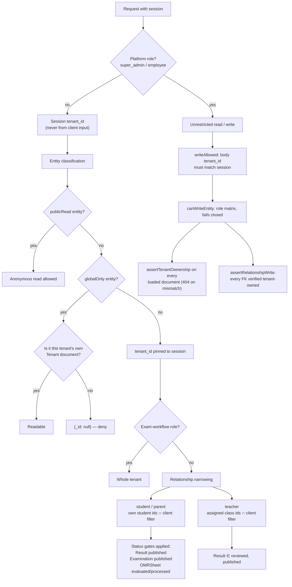

---

## 11. Institution Login and Custom Domains

### 11.1 Two front doors

*(Current)* There are two ways into a tenant:

- **Path-based:** `/s/:school`, `/s/:school/login`, `/portal/:school`, `/institute/:school` render `src/pages/Login.jsx` with the `school` param. Non-email identifier login requires one of these, because the server refuses an identifier login with no resolved tenant.
- **Hostname-based:** any host that is not localhost or a `PLATFORM_HOSTS` entry is treated as a branding candidate by `useTenantDomain`, and the login page renders with that tenant's public branding.

### 11.2 The public site function

*(Current)* `POST /api/functions/publicSite` is unauthenticated and dispatches on `action`:

| Action | Behaviour |
|---|---|
| `plans` | Reads all `SubscriptionPlan` documents and returns them through `presentAll`. |
| `lookup` | Institution search over `name`, `subdomain`, `custom_domain`, `city` for **active** tenants only, escaped regex, `limit(8)`, projecting only public display fields. Rate-limited to 60 / 15 min per IP. |
| `branding` | Resolves a tenant from a school name or hostname. For `custom_domain` the match is on the **exact canonical hostname only** — a deterministic, non-regex mapping — so a domain can never resolve to the wrong tenant. |

*(Current)* Because the branding response is derived from `Tenant` documents, it is redacted by `redactTenantBranding`, a strict secret-free subset of `TENANT_PUBLIC_FIELDS` that cannot be widened by a role.

### 11.3 Hostname canonicalization

*(Current)* `shared/custom-domain.js` is dependency-free specifically so the same code runs in the browser bundle and on the server. `normalizeHost` is the single source of truth: lowercase, strip an `https?://` scheme, strip leading slashes, strip a trailing `.`, then **reject** (return `null` rather than silently drop) anything containing `/`, `?`, `#`, whitespace, a `:port`, or a `*.` wildcard. `classifyHost` buckets a hostname as `platform`, `portal-subdomain`, `apex`, `subdomain`, or `unknown`. `isPrivateIp` rejects RFC1918, CGNAT, link-local, loopback, and the IPv6 equivalents (including IPv4-mapped forms), which is the DNS-rebinding / localhost-exfiltration guard for anything the server dials.

### 11.4 The verification pipeline

*(Current)* `server/lib/domainVerifier.js` is provider-agnostic — it reasons only about DNS records, TLS, and the app's own identity markers, and all DNS and network access is behind injected callbacks so tests run fully mocked. Failure reasons are a frozen enum: `DNS_NOT_FOUND`, `DNS_TARGET_MISMATCH`, `DNS_REQUEST_FAILED`, `SSRF_BLOCKED`, `TLS_FAILED`, `APP_NOT_REACHABLE`, `APP_IDENTITY_FAILED`, with `humanReason` mapping each to non-technical wording for the super-admin surface.

*(Current)* `server/lib/activationOrchestrator.js` sequences the activation step in a fixed order, and the ordering is the point: DNS gate (so a misconfigured CNAME is rejected before any vendor API is called) → hosting provider attach → provider verification poll → live probe. The header states the invariant plainly: *a domain is never marked live just because the Vercel API accepted it.* The Phase 1 live probe (HTTPS/TLS plus the EXAM OS identity marker) is the final and only authority for `LIVE`. Stages: `DNS_FAILED`, `HOSTING_UNCONFIGURED`, `HOSTING_FAILED`, `VERIFICATION_PENDING`, `PROBE_FAILED`, `LIVE`.

*(Current)* `server/lib/domainGuard.js` guards uniqueness and shape on both the write and the lookup side: `assertCustomDomainAvailable`, `normalizeSubdomain`, `isReservedSubdomain`, `assertSubdomainUsable`, `assertSubdomainAvailable`. `verifyCustomDomain` calls `assertCustomDomainAvailable` before writing, so a normalized domain is reserved for that tenant even while still pending.

*(Current)* `server/lib/hosting.js` validates a provider against `REQUIRED_PROVIDER_METHODS` and registers it in a registry; `server/lib/vercelProvider.js` is registered only when credentials are present, and the source notes that without them the app runs exactly as before using the manual provider.

### 11.5 Monitoring

*(Current)* `GET /api/cron/domain-monitor` requires `CRON_SECRET`: unset returns 503, a bad token returns 401 via `verifyCronToken`. It calls the monitor with `force` when `?force=1`. `DomainMonitorRun` is a single-document state collection (a lease: `DOMAIN_MONITOR_LEASE_MS`) so concurrent invocations do not duplicate work. `buildDomainAlert` constructs the operator alert with a configurable CNAME target defaulting to `examos.avexora.in`.

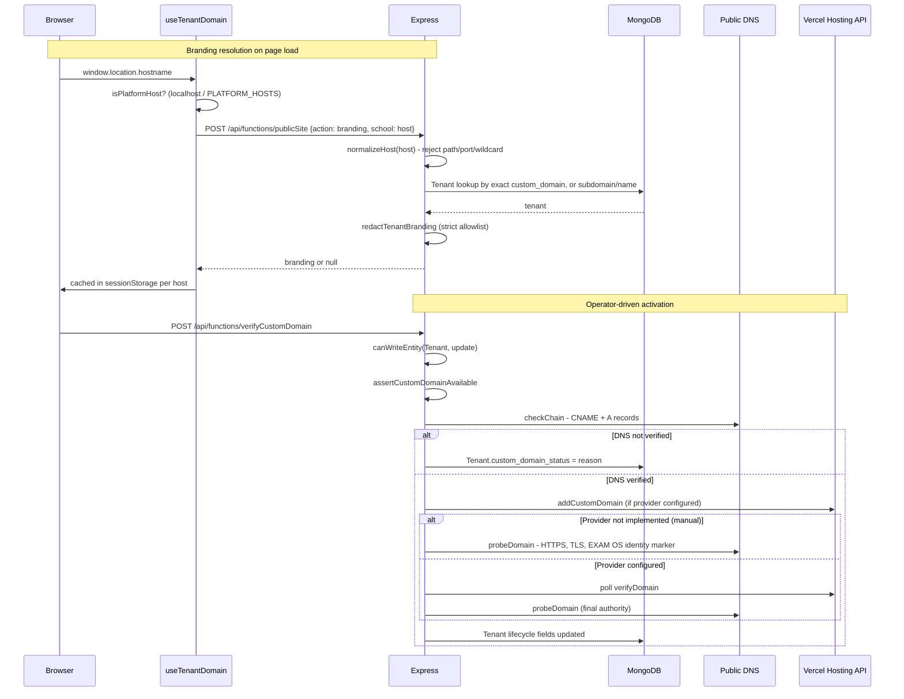

---

## 12. Examination Lifecycle

### 12.1 The status ladder

*(Current)* `src/components/exams/ExamWorkflowSteps.jsx` defines the six statuses and the six user-visible steps. `server/index.js`'s `FROZEN_EXAM_STATUSES` comment states it mirrors this ladder.

| Status | UI step label |
|---|---|
| `draft` | Setup & Answer Key |
| `scheduled` | Print OMR Sheets |
| `omr_in_progress` | Scan & Upload |
| `evaluated` | Evaluate |
| `reviewed` | Review |
| `published` | Publish Results |

### 12.2 What the server actually enforces

*(Current)* Only three transition rules are enforced server-side:

1. **Teacher status restriction.** A teacher may only *create* an examination as `draft`; any other status on create is 403, and any `status` key on update is 403. The source explains both halves: without the first a teacher could POST an already-`published` examination and skip sign-off; without the second a teacher could move status backwards to un-freeze a locked answer key.
2. **Answer-key freeze.** `FROZEN_EXAM_STATUSES = {evaluated, reviewed, published}`. Once the parent examination reaches any of these, an `AnswerKey` write is 409 "Answer key is locked". The reason given is that the key is the input to evaluation, so changing it afterwards would silently invalidate every `Result` already computed from it.
3. **Answer-key integrity.** An `AnswerKey` write requires a valid `examination_id` belonging to the caller's tenant, and a duplicate key for the same paper set is rejected up front rather than resolved arbitrarily (the panel reads with `filter()` and takes the first hit; evaluation reads with `findOne`).

`INFERRED` — Beyond those three, **there is no server-side transition table for examinations or results.** Any role holding `Examination.update` or `Result.update` in the write matrix can `PATCH` any status the entity accepts, in any direction. The `draft → reviewed → published` progression for `Result` and the `evaluated → reviewed → published` progression for `Examination` are driven entirely by `src/components/exams/ResultsPanel.jsx` calling the generic entity update endpoints. A coordinator with a crafted request can skip `reviewed`, and can move a `published` examination back to `draft`. This is a real gap; see [§20](#20-architectural-problems) item P5.

*(Current)* One partial mitigation exists: family reads are status-gated in `readScope` — a student or parent sees only `published` examinations and only `published` results, and a teacher sees only `reviewed`/`published` results. So an out-of-order status change is not exposed to family or teacher views even though it is accepted in storage.

### 12.3 The authoritative roster

*(Current)* `server/examRosterService.js` derives and persists an `ExamRoster` collection per examination, rebuilt from `Examination → AcademicYear → Enrollment (active) → Student → admission_number`. Its header states the invariant: *one roster, one truth: OMR identity, exam attendance, and evaluation all read the ExamRoster. Never queries loose class_name.*

Exported functions: `resolveExamScope`, `deriveEnrolledStudents`, `ensureExamRoster`, `getExamRoster`, `getExamRosterStudentIds`, `studentInExamRoster`, `syncEnrollmentRosters`.

*(Current)* Roster membership is a gate in three separate places: `assertRelationshipWrite` refuses an `OMRSheet.student_id` not on the roster; `processOMRSheet` refuses an `override_student_id` not on the roster; `evaluateExamination` grades only sheets whose assigned student is on the roster, with the comment that sheets re-assigned to a non-roster student are never evaluated.

### 12.4 Results

*(Current)* `Result` documents are written with `status: "draft"` and upserted on the key `(examination_id, student_id, tenant_id)` — the tenant in the filter is explicitly there so a result can never be overwritten from another tenant's view of the exam. Grading computes `correctCount`, `incorrectCount`, `blankCount`, then `score = max(0, correct × marksPerQuestion − incorrect × negativeMarks)`, `percentage`, a `grade` band, `passed` against `passingMarks`, and duplicate column names for both the new and legacy vocabulary (`correct_count`/`correct_answers`, `wrong_count`/`incorrect_answers`, `skipped_count`/`unattempted`). `evaluateExamination` sorts by total marks and assigns `rank`, then computes `percentile` as `((n − idx − 1) / (n − 1)) × 100`.

*(Current)* `src/components/exams/ResultsPanel.jsx` drives the rest: it moves every `draft` result to `reviewed` in a batch and the examination to `reviewed`, then moves every result to `published` and the examination to `published`. The 33% default passing mark appears twice — `evaluateExamination` and the grading block of `processOMRSheet` — as `Math.round(maxMarks * 0.33)`.

*(Current)* `src/lib/scoreOMR.js` mirrors the backend scoring logic in the browser. It is a display aid; the authoritative score is what the server wrote.

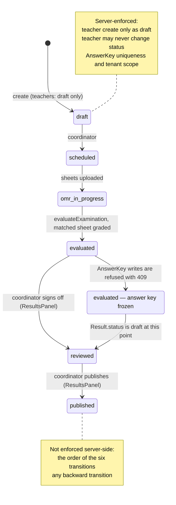

---

## 13. OMR Pipeline

### 13.1 Shape

*(Current)* OMR is executed synchronously inside the request that triggers it, on a Node `worker_thread`:

```
route handler (processOMRSheet)
  └─ runOmrEvaluator (server/index.js)
       └─ runOmrInWorker (server/omr-engine/omr-runner.mjs)
            └─ new Worker(eval-worker.mjs, { workerData })
                 └─ evaluateOMR (evaluator.mjs)   [OpenCV via @techstark/opencv-js WASM]
```

*(Current)* `runOmrInWorker` spawns exactly one worker per call, settles on the first of `message`, `error`, or a non-zero `exit`, always calls `worker.terminate()` on settle, and honours an optional `timeoutMs` by rejecting with code `OMR_TIMEOUT`. `runOmrEvaluator` defaults `timeoutMs` to **60,000 ms**.

*(Current)* `eval-worker.mjs` dispatches on `workerData.job`: `"generate"` (fixture generation via `generate-sample-omr.mjs`), `"corrupt"` (writes a deliberately unprocessable image), or the default evaluate path. It also polyfills `Promise.withResolvers` and `Promise.try` for the WASM OpenCV build.

*(Current)* The engine is the **JavaScript** evaluator, not the Python one. `evaluator.mjs` declares `ENGINE_VERSION = "1.3.0-js-wasm"` and loads OpenCV through `opencv-loader.mjs` (`@techstark/opencv-js`). `evaluator.py` and `server/omr-engine/requirements.txt` are present but excluded from the deployment by `.vercelignore`; they exist to generate the golden dataset.

### 13.2 The evaluation algorithm

*(Current)* Per `server/omr-engine/README.md` and `evaluator.mjs`:

1. Validate image presence, decodability, resolution, brightness, sharpness.
2. Detect the four solid black corner alignment markers produced by `src/lib/generateOMRSheetPDF.js`.
3. Four-point perspective transform, normalizing skewed or phone-photographed sheets to a 2100 × 2970 px A4 canvas.
4. Template-driven grid sampling from millimeter-exact coordinates in `templates/a4_20q_4opt_v1.json`, `a4_50q_4opt_v1.json`, `a4_100q_4opt_v1.json`. No generic contour bubble discovery — every bubble centre comes from the template.
5. Annulus-ROI ink measurement (default inner 0.40×, outer 0.88× of bubble radius) so preprinted border rings, centred option labels, and print artifacts are excluded from the student-ink signal.
6. Three signals per bubble: `fill_ratio` (per-bubble Otsu over the full bubble square, applied to annulus pixels), `adaptive_fill` (page-wide adaptive-threshold residue, an internal cross-check), `mean_intensity` (diagnostic).
7. Classification: `detected` (state `confident`, single bubble above the floor with a clear margin), `blank` (every option below the ceiling; `candidate_answer` is `null` and blank is never auto-prefilled in the review UI), `multiple_mark` (state `multiple`, flagged rather than silently picked), `ambiguous` (state `needs_review`).
8. Deterministic confidence — a pure function of bubble fills, margin, and image quality, with no RNG. Constants are named in `evaluator.mjs`: `CONF_CONFIDENT_BASE` 0.55, `CONF_CONFIDENT_CAP` 0.99, `CONF_BLANK_BASE` 0.6, `CONF_BLANK_CAP` 0.95, `CONF_REVIEW_BASE` 0.3, `CONF_REVIEW_CAP` 0.6.
9. Visual annotation: green circles over confident marks, red/amber indicators over flagged bubbles.
10. Structured JSON on stdout; `overallStatus = flaggedQuestions.length > 0 ? "review_required" : "completed"`.

### 13.3 `processOMRSheet`

*(Current)* `POST /api/functions/processOMRSheet` (alias `processOmrSheet` also accepted). Preconditions and behavior, in order:

1. **Role.** Requires `examWorkflow(req)` — `super_admin`, `school_admin`, `principal`, or `exam_coordinator`. A teacher gets 403.
2. **Identity override.** An optional `override_student_id` for the teacher-review flow re-assigns a sheet to a specific roster student without re-scanning. The student must exist in the sheet's tenant, and must be on the examination's authoritative roster (`studentInExamRoster`), else 400.
3. **Tenant ownership.** `assertTenantOwnership` on the sheet, the examination, and any pre-linked student. A mismatch is 404.
4. **Template selection.** `sheet.template_id` or `exam.template_id`, else by question count: ≤20 → `a4_20q_4opt_v1`, ≤50 → `a4_50q_4opt_v1`, else `a4_100q_4opt_v1`. Digit count defaults to 6 and is overridden by the tenant's `admission_number_num_digits`.
5. **Answer key.** Resolved by `(examination_id, paper_set, tenant_id)` with a tenant-only fallback.
6. **Non-CV paths.** `OMR_ENGINE_MODE === "mock"` (explicit) or a sheet with no `image_url` skips the CV stage. This is the only route to a non-CV result.
7. **Staging.** `stageOmrFile` resolves the sheet's `image_url` to a real local path. In S3 mode it looks for `private/<tenantId>/<file>`, then `private/platform/<file>`, then a `listKeys("private/")` suffix scan, and downloads to `os.tmpdir()/examos-omr`. An in-process `Map` caches the staged path. If nothing resolves, the sheet is set to `status: "failed"`, `processing_status: "failed"`, `error_code: "IMAGE_NOT_FOUND"`, an audit event is written, and the response is **422**. No result is ever fabricated from a missing image.
8. **Duplicate detection.** The image is SHA-256 hashed (`image_sha256`) and compared against other sheets for the same examination. An identical duplicate is rejected with 409 `DUPLICATE_FILE_UPLOAD`, the sheet is marked `rejected`, and an audit event is written.
9. **CV execution.** `runOmrEvaluator` produces extracted answers, per-question results with confidence, flagged questions, engine name and version, and an annotated PNG. In S3 mode the annotation is uploaded to `private/<tenantId>/` and the local file is unlinked. The response URL is a capability-token URL: `/api/files/<name>?token=<signed>`.
10. **CV failure.** Any evaluator error cleans up the local and S3 annotation objects, sets `status: "failed"`, `processing_status: "failed"`, records the error code and details, and audits. There is no fallback to mock answers.
11. **Identity resolution.** Unless overridden, `resolveStudentIdentity` maps the detected admission number to a roster row. Outcomes: `matched` (exactly one match, student exists in tenant), or `needs_review` with a typed reason — `UNREADABLE_ADMISSION_BUBBLES`, `EXAMINATION_NOT_FOUND`, `EMPTY_EXAM_ROSTER`, `NOT_ENROLLED_IN_EXAMINATION`, `MULTIPLE_ROSTER_MATCHES`. Number matching tolerates zero padding and leading zeros in both directions. `MULTIPLE_ROSTER_MATCHES` is described in the source as a load-bearing defense against legacy unindexed duplicates.
12. **Supersede.** When a student is resolved, any other sheet for the same examination and student is set to `is_active: false`, `status: "archived_superseded"` — deterministic replace and archive.
13. **Status computation.** `status` is `needs_review` when identity is unresolved or any question is flagged, else `completed`. `processing_status` is `review_required` when any question is flagged, else `completed`. `evaluation_status` is `needs_review` when flagged, `pending_identity` when identity is unresolved, else `completed`. `attendance_status` is `present` / `needs_review` / `unmarked`.
14. **Attendance.** A matched sheet records exam attendance `present` via `recordExamAttendance`. A pre-linked but unreadable sheet records `needs_review` explicitly, with the reason that it must not be silently swept to absent by reconciliation.
15. **Inline grading.** Only a `matched` sheet is graded, using the same scoring formula as `evaluateExamination`, upserted as a `draft` `Result` on `(tenant_id, examination_id, student_id)`.
16. **Persist and audit.** One `findOneAndUpdate` writes answers, both legacy and current field names, confidence scores, per-question results, resolved student, all three status fields, engine and version, template, flagged questions and count, the annotated image URL and filename, `matched`, `identity_status`, `attendance_status`, `evaluation_status`, the admission detection, the attendance flag, the match error, `image_sha256`, and timestamps. Then a `process_omr` audit event recording status, identity, flagged count, and engine.

### 13.4 `evaluateExamination`

*(Current)* `POST /api/functions/evaluateExamination` re-grades a whole examination. Filters are deliberately strict, and each one closes a specific failure:

- Requires `examWorkflow(req)`.
- `assertTenantOwnership` on the examination.
- Answer key cross-check: a key whose `tenant_id` differs from the exam's is 403.
- Only sheets with `status === "completed"` **and** `processing_status === "completed"` **and** roster membership **and** extracted answers are evaluable. The comment: *sheets awaiting manual review (needs_review) are NEVER graded automatically — fabricated/low-confidence reads must not affect results.*
- Sheets in `needs_review` or `review_required` are counted and reported in the response message, so the operator knows work remains.
- Per-sheet: skip on a tenant mismatch with the exam, skip if the student is missing or belongs to another tenant.
- With zero evaluable sheets, returns success with `count: 0` and a message distinguishing "still need manual review" from "no completed sheets found".
- Upserts each result on the tenant-scoped triple, then sets the examination to `evaluated`, then writes an `evaluate` audit event.

### 13.5 Throughput characteristics

*(Current)* There is no queue, no worker pool, no concurrency limit, no retry, and no backpressure. Each `processOMRSheet` call is one HTTP request that holds a worker thread for up to 60 seconds. A bulk upload in the UI processes files sequentially from the browser with a progress counter (`OMRUploadPanel` `bulkProgress`), so a class of 60 sheets occupies one browser request at a time. The function itself is configured for `maxDuration: 300` seconds and 1024 MB, so a long-running request is bounded by the platform but not by application logic. See [§20](#20-architectural-problems) item P3.

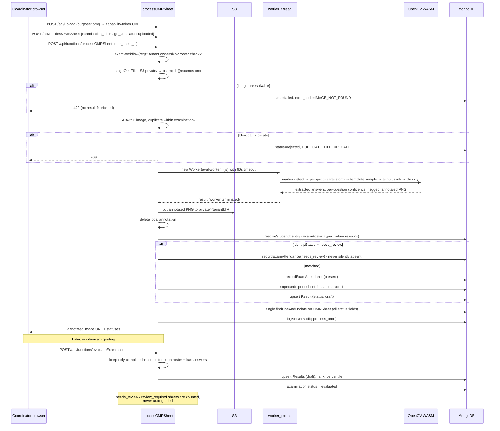

---

## 14. File Storage

### 14.1 Layout

*(Current)* Uploads are **private by default and tenant-scoped**, declared in the `SEC-03` block of `server/index.js`:

```
<uploadsDir>/
  tmp/                 multer staging, moved after validation
  public/              intentionally-public branding logos only
  private/<tenantId>/  OMR sheets, CSV extracts, exam documents
```

`<uploadsDir>` resolution: `UPLOADS_DIR` override → `os.tmpdir()/uploads` on Vercel (ephemeral, per invocation) → `<cwd>/uploads` otherwise.

*(Current)* URLs are opaque (`/api/files/<uuid>.<ext>`). Tenant ownership is derived from the authenticated session, never from client input.

### 14.2 Upload validation

*(Current)* `POST /api/upload` requires a session and `upload.single("file")` (Multer memory storage, so the buffer is available for signature checks).

| Purpose | Max size | Allowed extensions | Authorized roles |
|---|---|---|---|
| `omr` | 50 MB | `.pdf` (magic `%PDF-`), `.png`, `.jpg`, `.jpeg` | super_admin, school_admin, principal, exam_coordinator |
| `import` | 25 MB | `.csv` (validated as safe text), `.xlsx`, `.xls` | super_admin, school_admin, exam_coordinator |
| `logo` | 5 MB | `.png`, `.jpg`, `.jpeg`, `.gif`, `.webp`, `.bmp` | super_admin, school_admin |

*(Current)* Three validation properties worth calling out:

- **Extension and signature must agree.** A file's extension must match a per-purpose tuple *and* its leading bytes must match the same signature (`MAGIC_BYTES`). A `.png` upload whose bytes are not a PNG is rejected with "File contents do not match its declared type". The source frames this as file-type *trust*: the extension is not taken at face value.
- **CSV is special-cased.** It has no reliable signature, so it is validated as safe text (no binary or control data in the first 512 bytes) rather than by magic bytes.
- **Purpose is never silently rewritten.** An unrecognized `purpose` is a 400 naming the offending value; only an *absent* purpose falls back to `omr` for older callers. The comment explains: coercing a `purpose=logo` typo to `omr` would write the file into the wrong bucket and check it against the wrong roles.

*(Current)* The stored name is a fresh `crypto.randomUUID()` plus the validated extension, so a client-supplied filename never reaches storage.

### 14.3 Serving private files

*(Current)* `GET /api/files/:filename` resolves the owning tenant by three routes, in order:

1. **Bearer token, platform role** — a cross-tenant scan of `private/` keys (S3) or a readdir of tenant directories (local). Platform roles are institution-independent by design.
2. **Bearer token, tenant role** — `private/<tenantId>/<filename>` only.
3. **No bearer** — a signed capability token is required. `signFileToken(tenantId, filename, expiresAt)` produces `<expiresAt>.<tenantId>.<mac>` where `mac` is `HMAC-SHA256(JWT_SECRET, "<tenantId>:<filename>:<expiresAt>")` in base64url, compared with a timing-safe buffer compare. The tenant segment is regex-validated (`[0-9a-f]{24}` or the literal `platform`). This is the only path that serves browser-rendered `` and `<a>` requests, where a `Authorization` header is impractical.

*(Current)* Private responses carry `Content-Disposition: inline`, `X-Content-Type-Options: nosniff`, and `Cache-Control: private, no-store`. `GET /api/public/uploads/:filename` serves only the `public/` prefix, with `Cache-Control: public, max-age=900`.

*(Current)* Every filename passes `STORED_FILE_RE` before any path work, and local paths are re-resolved through `safeResolveUnder(privateUploadsDir, ...)` after construction — a defence against a path that escapes the base directory.

### 14.4 S3 backend

*(Current)* `server/lib/s3.js` resolves the mode once at startup via `initStorage()`:

| Condition | Result |
|---|---|
| `STORAGE_BACKEND=local` | `local` (explicit override for hermetic tests/dev) |
| `STORAGE_BACKEND=s3` without `AWS_BUCKET_NAME` | **throws** |
| `AWS_BUCKET_NAME` set and `headBucket` succeeds | `s3` |
| No bucket, `NODE_ENV !== production` | `local`, with a warning if a bucket was configured but invalid |
| No bucket, `NODE_ENV === production` | **throws** — "refusing to fall back to local disk" |
| Bucket set but `headBucket` fails, production | **throws** with the region and cause |
| Bucket set but `headBucket` fails, non-production | warns, clears `AWS_BUCKET_NAME`, falls back to `local` |

*(Current)* Region resolution: `AWS_REGION` → `AWS_DEFAULT_REGION` → `ap-south-1`. Credentials: explicit `AWS_ACCESS_KEY_ID` / `AWS_SECRET_ACCESS_KEY` (with optional `AWS_SESSION_TOKEN`) or the SDK default chain, so an instance or task role works without static keys. `AWS_S3_ENDPOINT` enables a path-style S3-compatible endpoint.

*(Current)* `getStorage()` throws if `initStorage()` was never called, which is why every call site has to go through startup first.

### 14.5 OMR staging

*(Current)* The CV engine needs a real filesystem path (OpenCV works on files), so in S3 mode every OMR image is downloaded to `os.tmpdir()/examos-omr/<name>` before processing and the annotated PNG is pushed back before the local file is unlinked. The `omrScratchIndex` `Map` caches staged paths for the process lifetime, and both the success and failure paths clean up.

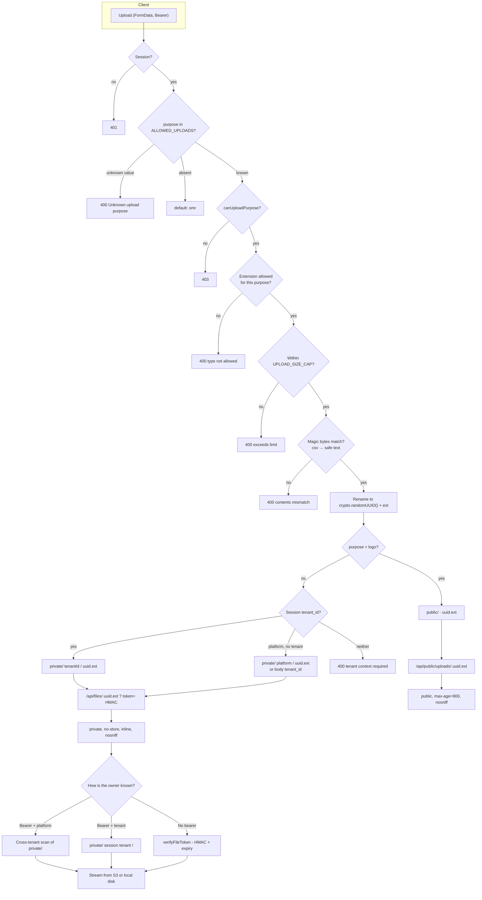

---

## 15. Data Model and Collections

### 15.1 Collection inventory

*(Current)* 34 collections are in play. 32 are referenced by a literal `collection("...")` call across `server/`, `shared/`, `api/`, and `scripts/`; two more — `AssignmentSubmission` and `OMRCorrection` — are reachable only through the generic entity route, which resolves the collection name dynamically via `col(name)` from the `allowed` set, so no literal call exists for them. Collections are PascalCase; documents carry `tenant_id` where tenant-scoped, and string ISO-8601 `created_date` / `updated_date` fields rather than BSON dates.

| Collection | Role |
|---|---|
| `User` | Accounts, roles, credential material, verification state |
| `Tenant` | Institution, plan, branding, custom-domain lifecycle |
| `SubscriptionPlan` | Plan catalogue (publicly readable) |
| `PlatformBranding` | Platform-level branding (publicly readable) |
| `Announcement` | Platform announcements (publicly readable) |
| `TenantAnnouncement` | Per-tenant announcements, optionally `target_roles`-directed |
| `AcademicYear` | Academic years |
| `SchoolClass` | Classes |
| `Section` | Sections within a class |
| `Subject` | Subjects |
| `Student` | Student records, admission and roll numbers |
| `Teacher` | Teacher profiles with denormalized `assigned_class_ids` |
| `TeacherAssignment` | Live class/section/subject assignment rows |
| `Parent` | Parent records |
| `ParentStudent` | Parent-child link rows |
| `Enrollment` | Student enrollment into year/class/section |
| `Examination` | Exam metadata and lifecycle status |
| `ExamRoster` | Persisted authoritative per-exam roster |
| `AnswerKey` | Answer keys, per paper set |
| `OMRSheet` | Raw scans, CV output, identity and processing status |
| `OMRCorrection` | Manual correction records (create-only) |
| `Result` | Computed marks, grade, rank, percentile, publication status |
| `Attendance` | Daily and per-exam attendance |
| `Assignment`, `AssignmentSubmission` | Coursework |
| `AuditLog` | Audit trail (server-written only) |
| `Payment` | Payment records (platform-scoped) |
| `Lead` | Sales leads and their status |
| `LeadCommunication` | Outbound lead email and WhatsApp message history |
| `LeadSettings`, `IntegrationSettings` | Lead and integration configuration |
| `DomainMonitorRun` | Single-document monitor lease and last-run state |
| `RateLimit` | Mongo-backed rate-limit counters (when the Mongo store is active) |
| `SequenceCounter` | Per-tenant admission / roll number sequences |

*(Current)* The `allowed` set in `server/index.js` (27 names) is the set reachable through the generic entity API. Collections outside it — `DomainMonitorRun`, `ExamRoster`, `IntegrationSettings`, `LeadCommunication`, `LeadSettings`, `RateLimit`, `SequenceCounter` — are reachable only through their owning module, which is correct: those are internal state, not user-editable resources.

*(Current)* `server/seed.js` (674 lines) populates `User`, `Tenant`, `SubscriptionPlan`, `PlatformBranding`, `Announcement`, `Lead`, `Payment`, `SchoolClass`, `Subject`, `Teacher`, `Student`, `Examination`, `AnswerKey`, `OMRSheet`, `Result`, `TenantAnnouncement`, `AuditLog`.

### 15.2 Migration and schema evolution

*(Current)* There is **no migration framework**. Schema changes are one-off scripts run manually:

| Script | Purpose |
|---|---|
| `server/ensure-indexes.js` | Idempotent index creation with duplicate preflight |
| `server/backfill-email-verified.js` | Backfill the verification flag (also `npm run backfill:email-verified`) |
| `server/backfill-subject-streams.js` | Backfill subject streams |
| `scripts/backfill-enrollments.mjs` | Backfill enrollments |
| `scripts/backfill-student-class-ids.mjs` | Backfill denormalized class ids on students |
| `scripts/migrate-exam-roster.mjs` | Populate the `ExamRoster` collection |
| `scripts/audit-admission-numbers.mjs` | Audit admission number uniqueness |

*(Current)* `ensure-indexes.js` states its own contract: it **never modifies existing records**. If a proposed unique index would conflict with existing data, creation fails and the conflicts are reported, leaving data untouched.

---

## 16. API Surface

*(Current)* This section documents route **families and their semantics**, not a per-field schema. All paths are relative to `/api`.

### 16.1 Authentication

| Method | Path | Auth | Semantics |
|---|---|---|---|
| POST | `/auth/register` | none | Creates a tenant and a `school_admin` user. Never grants a platform role. Rate-limited per IP. Returns a token plus `verification_required`. |
| POST | `/auth/login` | none | Email or non-email identifier. Identifier login requires a resolved tenant. Rate limits and lockout run before bcrypt. |
| GET | `/auth/me` | session | Identity and entitlements. 403 `NO_ASSIGNED_ROLE` for an unrecognized role. On the verification allowlist. |
| POST | `/auth/reset-password-request` | none | Issues a reset token. Budgets per email and per IP. |
| POST | `/auth/reset-password` | token | Consumes a reset token. |
| POST | `/auth/verify-email` | token | Flips `email_verified`; the only writer of that field. Takes no tenant or role argument by design. |
| POST | `/auth/resend-verification` | session | Re-issues. Authenticated, so the client must keep the token on `EMAIL_UNVERIFIED`. |
| POST | `/auth/change-password` | session | Verifies the current password. On the first-login allowlist. |

### 16.2 Generic entity CRUD

*(Current)* One generic surface for 27 collections. Every route: entity name validated against `allowed` (else 404), `readScope` applied on reads, `canWriteEntity` + `writeAllowed` on writes, `assertRelationshipWrite` for cross-document references, `present()` redaction on output, `logServerAudit` on audited mutations.

| Method | Path | Semantics |
|---|---|---|
| GET | `/entities/:name` | List with `sort` and `limit` (default 10000). `AuditLog` additionally requires `canReadAuditLog`. |
| POST | `/entities/:name/filter` | `{query, sort, limit, skip}`. `query` passes through `isSafeQueryValue`, so operators are dropped. |
| GET | `/entities/:name/:id` | Single read, scoped. |
| POST | `/entities/:name` | Create. Flat body; a wrapper-shaped body is 400. |
| PATCH | `/entities/:name/:id` | Update. Flat body only (`assertFlatUpdateBody`). |
| DELETE | `/entities/:name/:id` | Delete. |
| POST | `/entities/:name/bulk` | `{items}` — each item validated by `assertRelationshipWrite`. |
| PATCH | `/entities/:name/bulk` | `{items}` — per-item guards. |
| PATCH | `/entities/:name/many` | `{query, update}` — unwraps its own body, unlike the single-record route. |
| DELETE | `/entities/:name/many` | `{query}` — all the single-record guards apply, including the User privilege guard. |

*(Current)* The `User` routes are special-cased: a body containing `app_role` **or** `app_roles` is delegated to `assignUserRoles` (hierarchy check + tenant pairing + audit) rather than written directly, so a multi-role set cannot be smuggled in through the generic `$set` either, and `userPrivilegeWriteRefused` blocks credential fields, `email_verified`, legacy `role`, and tenant moves.

### 16.3 Files

| Method | Path | Auth | Semantics |
|---|---|---|---|
| POST | `/upload` | session | Multipart, `purpose`-gated, extension + magic-byte validated, size-capped. Returns a public or capability-token URL. |
| GET | `/files/:filename` | session **or** capability token | Private file. Tenant from session, platform scan, or HMAC token. |
| GET | `/public/uploads/:filename` | none | Branding logos only, from the `public/` prefix. |

### 16.4 Backend functions

*(Current)* `POST /functions/:name` is a single dispatcher over an `if (fnName === ...)` chain. 19 comparisons cover 18 distinct names (one of them, `processOmrSheet`, is an alias, so 17 unique operations); unknown names fall through to a 404 at the end of the chain.

| Name | Auth | Semantics |
|---|---|---|
| `publicSite` | none | `plans` / `lookup` / `branding`. Rate-limited on `lookup`. |
| `getExamTimetable` | session | Date sheet plus, for `EXAM_MATERIAL_ROLES`, exam content. |
| `getExamRoster` | session | Authoritative roster; teacher scope enforced. |
| `previewExamRoster` | session | Pre-import roster preview. Tenant derived from the selected `AcademicYear` for platform users. |
| `getNextStudentNumbers` | session | Admission / roll number preview. |
| `getMyTenant` | session | Own tenant, via `resolveReadableTenantId`. |
| `deleteMyAccount` | session | Self-service deletion, refused for platform roles. |
| `manageStaff` | session | `getAssignedTenants` / `setAssignedTenants` for employee tenant assignments; super-admin only for the set path. |
| `linkMyAccount` | session | Links a family account to a student record. |
| `startFreeTrial` | `canStartTrial` | Mints a tenant and self-promotes the caller. |
| `processOMRSheet` (alias `processOmrSheet`) | `examWorkflow` | The OMR pipeline. See §13. |
| `evaluateExamination` | `examWorkflow` | Whole-exam grading. See §13. |
| `verifyCustomDomain` | `canWriteEntity(Tenant, update)` | DNS check and reservation. |
| `manageCustomDomain` | session | Domain lifecycle management. |
| `runDomainMonitor`, `getDomainMonitorStatus`, `sendTestDomainAlert` | session | Monitor control surface. |
| `logAudit` | session | Restricted to `CLIENT_AUDIT_EVENTS`, whose permitted roles are read from `ENTITY_WRITE_ROLES` so a client can never log an event for a write it could not perform. |

*(Current)* Five backend functions additionally have dedicated routes, so their service module is called directly rather than through the dispatcher: `POST /functions/setupAcademicStructure`, `/functions/saveBatchAttendance`, `/functions/getAttendanceHistory`, `/functions/getExamAttendance`, `/functions/reconcileExamAbsentees`.

### 16.5 Platform, leads, and operations

| Method | Path | Auth | Semantics |
|---|---|---|---|
| GET | `/health` | none | Liveness. |
| GET | `/cron/domain-monitor` | `CRON_SECRET` | Hourly monitor. 503 when unconfigured. |
| POST | `/users/provision` | `canProvisionRole` | Creates an account with a temporary credential and an audit event. |
| POST | `/users/invite` | `canProvisionRole` | Invitation flow, rate-limited per admin and per recipient. |
| GET, POST | `/leads` | `requireSuperAdmin` | Search, filter, paginate, with headline statistics. |
| GET | `/leads/:id/email-history` | `requireSuperAdmin` | Outbound email history. |
| POST | `/leads/:id/email` | `requireSuperAdmin` | Send. The recipient is always derived from the stored lead, never from the client. |
| GET, POST | `/leads/:id/whatsapp` | `requireSuperAdmin` | Conversation and send. |
| GET | `/leads/:id/whatsapp/templates` | `requireSuperAdmin` | Template catalogue. |
| POST | `/leads/:id/whatsapp/messages` | `requireSuperAdmin` | Text send. |
| POST | `/leads/:id/whatsapp/media` | `requireSuperAdmin` | Media send. |
| POST | `/webhooks/whatsapp` | provider | Inbound webhook. One of only two lead routes not gated by `requireSuperAdmin`. |
| GET, PUT | `/lead-settings` | `requireSuperAdmin` | Lead configuration. |
| GET, PUT | `/integration-settings` | `requireSuperAdmin` | Integration configuration. |
| POST | `/integrations/extract` | `canExtractRoster` | Roster extraction preview. |
| POST | `/integrations/:name` | session | Generic integration shim; returns `{status:"success", output:{}}`. |

*(Current)* `parseLeadId` validates the id with `ObjectId.isValid` and throws a 400-carrying error otherwise, so a malformed lead id never reaches a query.

### 16.6 Response and error contract

*(Current)* The `route()` wrapper establishes a single error contract:

| Condition | Status |
|---|---|
| Success | 200, or 201 on create |
| Authentication required | 401 |
| Verification / first-login gate | 403 with a `code` the client switches on |
| Policy refusal | 403 |
| Tenant mismatch (`assertTenantOwnership`) | **404**, not 403 |
| Malformed input, invalid id, failed precondition | 400 |
| Duplicate key (Mongo `11000`) | 409 |
| Answer key frozen | 409 |
| Resource type not in `allowed` | 404 |
| OMR image unresolvable | 422 with an `error_code` |
| Rate limit exceeded | 429 with numeric `Retry-After` |

*(Current)* Error bodies are `{ error: string }` with optional `code`, `error_code`, `details`, `email`, `uid`, `message`. `installApiLogging` captures any string `error` field and appends it to the end-of-request log line, so the log and the response cannot drift.

---

## 17. Security Controls

### 17.1 Implemented controls

*(Current)* Transport and headers:
- CSP: `default-src 'self'`, `script-src 'self'`, `style-src 'self' 'unsafe-inline'`, `img-src 'self' data: blob:` plus the Wix static hosts, `font-src 'self' data:`, `connect-src 'self'`, `frame-ancestors 'none'`, `base-uri 'self'`, `form-action 'self'`, `object-src 'none'`, `worker-src 'self' blob:`. Declared twice — once in the server middleware, once in `vercel.json`.
- `X-Content-Type-Options: nosniff`, `X-Frame-Options: DENY`, `Referrer-Policy: strict-origin-when-cross-origin` on the server; `vercel.json` adds HSTS and nosniff on `/assets/(.*)`.
- HSTS is conditional on `req.secure` or `X-Forwarded-Proto: https`, so it is never forced over local plain HTTP.
- `app.disable("x-powered-by")`.
- CORS is an explicit `CLIENT_ORIGIN` allowlist with `credentials: false`, and no allow-all fallback. Bearer-token auth is why credentials are off.

*(Current)* Secrets and tokens:
- `JWT_SECRET` absence is fatal at startup.
- bcrypt cost 10.
- Reset and verification tokens stored hashed (SHA-256), never in plaintext.
- `SECRET_ENTITY_FIELDS` stripped on every `User` serialization.
- `redactTenant` is an allowlist, so a new `Tenant` field is not readable until explicitly added.
- `integrations` secrets encrypted via `services/crypto.js` when `SETTINGS_ENC_KEY` is set.

*(Current)* Injection and traversal:
- `isSafeQueryValue` drops client operators, so a client filter cannot inject `$or`, `$where`, or `$regex`.
- `STORED_FILE_RE` gates every filename; `safeResolveUnder` re-validates constructed local paths.
- Regex built from user input in the tenant `lookup` and `branding` actions is escaped.
- Mongo duplicate-key errors are mapped to 409 rather than leaking.

*(Current)* Upload:
- Extension and magic byte must agree; CSV validated as safe text.
- Per-purpose size caps.
- Purpose authorization is independent of the page that rendered the control.
- Client filenames never reach storage.

*(Current)* OMR:
- `isPrivateIp` blocks RFC1918, CGNAT, link-local, loopback, and IPv6 equivalents from being dialled — a DNS-rebinding guard on the domain probe.
- Unresolvable image → 422 and `failed`, never a mock fallback.
- Identical duplicate image → 409 `DUPLICATE_FILE_UPLOAD`.
- Low-confidence and identity-ambiguous sheets are never auto-graded.
- The roster gate is applied at write, at override, and at evaluation.

### 17.2 Rate limiting

*(Current)* `RATE_LIMITS` is a declared table of budgets:

| Budget | Window | Limit | Scope |
|---|---|---|---|
| `loginFail` | 15 min | 10 | per (account, IP) composite |
| `loginIpFail` | 15 min | 100 | per IP |
| `loginLockout` | 30 min | lockout | per (account, IP) composite |
| `register` | 15 min | 10 | per IP |
| `tenantLookup` | 15 min | 60 | per IP |
| `resetRequestEmail` | 60 min | 5 | per email |
| `resetRequestIp` | 60 min | 20 | per IP |
| `resetPasswordIp` | 15 min | 30 | per IP |
| `changePassword` | 15 min | 20 | per IP |
| `inviteAdmin` | 24 h | 50 | per admin |
| `inviteRecipient` | 24 h | 1 | per recipient |
| `leadCreate` | 1 h | 20 | per caller |
| `leadEmail` | 1 h | 30 | per caller |
| `leadWhatsapp` | 1 h | 60 | per caller |
| `verifyEmailResend` | 60 min | 5 | per user |
| `verifyEmailResendIp` | 60 min | 30 | per IP |
| `verifyEmailIp` | 15 min | 30 | per IP |

*(Current)* `verifyEmailResend` is split per-user and per-IP deliberately, with the reasoning in the source: resend defends against inbox flooding (bounded per recipient, loosely per IP so a shared school NAT is not locked out), while the verify call itself is a token-guessing vector (bounded per IP, since the token is 32 random bytes and cannot be brute-forced, but the endpoint is public and each attempt costs a DB read).

*(Current)* `getClientIp` trusts only `req.socket.remoteAddress` off Vercel — forwarding headers are never used, because they are spoofable. On Vercel it reads the **first** `X-Forwarded-For` value only, on the reasoning that the edge terminates TLS and rewrites that header with the remote address first (a single trusted hop).

*(Current)* Store selection: `MongoRateStore` when `VERCEL` is set or `RATE_LIMIT_STORE=mongo`; otherwise `MemoryRateStore`. `RATE_LIMIT_MS_SCALE` scales windows for tests.

*(Current)* `runLimit` is **fail-open**: a store error logs a warning and returns `{count: 0}`, so a rate-limit store outage never breaks a request. This is an availability-over-security trade-off and is stated as such in the source.

### 17.3 Audit

*(Current)* `logServerAudit(req, { action, entity_type, entity_id, details, actor })`:
- Actor identity and tenant always derive from the verified session, or from an explicit `actor` override for routes that are anonymous by design (registration, token verification) — and that override is built from the document the request matched, never from `req.body`.
- Best-effort: a write failure logs `Audit log write failed (non-fatal)` and the business operation still succeeds.
- Fields are length-sliced (`action` 80, `entity_type` 80, `entity_id` 120, `details` 500).
- No secrets are ever written.

*(Current)* `SERVER_AUDIT_EVENTS` (15 entities) — these mutations are audited server-side only and are never accepted from a client `logAudit` call. `CLIENT_AUDIT_EVENTS` is a narrow allowlist of `verb:entity` pairs (`SchoolClass`, `Subject`, `Teacher`, `SubscriptionPlan`) whose permitted roles are **read from `ENTITY_WRITE_ROLES`** rather than restated, so the two cannot drift.

### 17.4 NOT CURRENTLY IMPLEMENTED: security controls

*(Current)* The following are absent. Stated plainly so nobody assumes them:

| Control | Status | Consequence |
|---|---|---|
| JWT revocation / deny-list | absent | A 7-day token remains valid for its full 7 days even if the account is disabled, the password is changed, or the role is stripped. Authorization *state* is re-read per request, so a role change takes effect immediately; the *session* cannot be cut short. |
| Refresh tokens / rotation | absent | A single long-lived token. |
| Multi-factor authentication | absent | Single factor (password) per account. |
| `helmet` | absent | Headers are hand-written, so a new route does not inherit them. The `vercel.json` duplication is a manual mirror of the server middleware. |
| CSP nonce / hash | absent | `script-src 'self'` only, which is workable here because there is no inline script in the bundle, but there is no per-request nonce. |
| WAF / bot protection | absent | Protection is the rate-limit table only. |
| Account lockout beyond rate limiting | absent | `loginLockout` is a rate-limit lock, not an account-level lock; an attacker who stays under the per-IP aggregate is bounded, not stopped. |
| Server-side plan entitlement enforcement | absent | `student_limit` and `omr_sheet_limit_per_month` are checked only in the browser. See P4. |
| Payment processing | absent | `@stripe/*` are declared dependencies with no import. `src/pages/Checkout.jsx` activates a free trial via `startFreeTrial` and takes no payment. No Stripe call exists anywhere. |
| Firebase Storage | absent | `src/api/firebase.js` initializes a Firebase app and exports `firebaseStorage`, but nothing imports it. `firebase` is a declared dependency. |
| Server-side status-transition validation | absent | See P5. |

### 17.5 Data protection posture

*(Current)* Beyond field redaction, the notable properties are: tokens and verification codes are stored hashed; the platform default password `PROVISIONING_DEFAULT_PASSWORD` (default `Welcome@123`) is applied only to newly provisioned student/parent accounts, and those accounts are immediately flagged `must_change_password`, which the first-login gate enforces server-side; and a lead's outbound email recipient is derived from the stored lead document rather than from the request.

`INFERRED` — Because the first-login gate only covers `student` and `parent` roles, a provisioned *teacher* or *staff* account using the same shared default password is not blocked from continuing. `PROVISIONING_DEFAULT_PASSWORD` is documented as a "shared institution default password" and is readable by `school_admin` through `TENANT_ADMIN_FIELDS`. Worth confirming whether staff provisioning is intended to use the same credential and, if so, whether the first-login gate should extend to them.

---

## 18. Audit and Observability

### 18.1 What exists

*(Current)* `server/logger.js` `installApiLogging` is the entire observability surface:

- Skips `OPTIONS`, and paths under `/uploads` or `/api/uploads`.
- Adopts a client `X-Request-ID` when it matches `/^[A-Za-z0-9._-]{1,64}$/`, otherwise generates a `crypto.randomUUID()`.
- Sets `X-Request-ID` on the response.
- Logs `[API START] requestId=... method=... path=...` on entry.
- Wraps `res.json` to capture any string `error` field into `res.locals.logError`.
- Logs `[API END] requestId=... method=... path=... status=... duration=...ms` plus the captured error, on `finish`, using `process.hrtime.bigint()` for timing.

*(Current)* Elsewhere: `console.warn` for non-fatal audit failures, `console.error` in the `route()` catch-all, `console.warn` for the fail-open rate-limit path, and `console.log` for the S3 startup line and the listen banner.

### 18.2 What is absent

*(Current)* There is no structured logging, no log level, no log sink, no metrics, no tracing, no error reporting service, and no alerting. `console.log` in a serverless function writes to platform logs, where lines from concurrent invocations interleave; the `requestId` makes manual correlation possible but nothing aggregates on it.

*(Current)* Concretely, the following are not measurable from the running system: OMR evaluation latency or failure rate; authentication failure rate; rate-limit trip counts; audit-write failure rate (only visible as a log line); Mongo connection state after startup; worker-thread timeout occurrences beyond the returned error. See P6.

---

## 19. Testing and Quality

### 19.1 Wired into `npm test`

*(Current)* `node --test server/test` runs 12 files (11 test suites plus the shared `helpers.mjs`), all pure or fully mocked — no live MongoDB required:

| File | Focus |
|---|---|
| `rbac.test.mjs` | 40 cases: role vocabulary, group partitioning, fail-closed `canWriteEntity`, `AuditLog` denial, per-role write boundaries, delegation hierarchy, upload purposes, `canExtractRoster`, trial restriction, self-deletion, tenant readability, redaction allowlists, subdomain rules, query-operator safety, verification semantics. |
| `custom-domain.test.mjs` | Hostname normalization, classification, private-IP detection |
| `domain-verifier.test.mjs` | DNS chain and probe outcomes against injected DNS/fetch |
| `domain-monitor.test.mjs` | Monitor scheduling, cron token, alert building |
| `hosting-contract.test.mjs` | Provider contract validation and registry |
| `vercel-provider.test.mjs` | Vercel provider behaviour against an injected client |
| `activation-orchestrator.test.mjs` | Activation stage ordering, including "never live without a probe" |
| `activation.test.mjs` | Activation flow integration with fakes |
| `tenant-resolution.test.mjs` | Tenant resolution from host and name |
| `uniqueness.test.mjs` | Subdomain / admission-number uniqueness preconditions |
| `live-probe.test.mjs` | Live-probe outcomes, including `APP_IDENTITY_FAILED` for a foreign app on the same host |
| `helpers.mjs` | Shared fakes (not a suite) |

*(Current)* `npm run test:rbac` runs `server/test-live/rbac-live.mjs` against `TEST_API_URL`, exercising 14 data collections against a live server.

### 19.2 Present but not wired

*(Current)* `scripts/` contains 27 `.mjs` files, of which 21 are test or test-like harnesses and 6 are operational scripts (`audit-admission-numbers.mjs`, `backfill-enrollments.mjs`, `backfill-student-class-ids.mjs`, `capture-super-admin-screenshots.mjs`, `migrate-exam-roster.mjs`, `scratch-bucket.mjs`). Several harnesses require a live server or MongoDB. The largest: `omr-cv-pipeline-test.mjs` (1,061 lines), `phase2-crm-workflows-test.mjs` (1,042), `lead-management-backend-test.mjs` (1,013), `unified-exam-platform-test.mjs` (958), `phase1-crm-workflows-test.mjs` (833), `crm-authorization-test.mjs` (672), `s3-storage-integration-test.mjs` (674), `security-fixes-test.mjs` (640), `user-provisioning-test.mjs` (632), `rate-limit-fixes-test.mjs` (575), `upload-security-test.mjs` (518), and the rest. None run in `npm test`, and there is no CI configuration to run them.

### 19.3 OMR golden-set parity

*(Current)* `server/omr-engine/golden/` holds 10 named cases with a `.json` expectation and a `.png` input: `perfect`, `blank_only`, `blur_brightness`, `close_margin`, `erasure`, `identity`, `mark_styles`, `multi_mark`, `perspective`, `rotated`, plus a `manifest.json`. `scripts/omr-parity-check.mjs` runs each through `runOmrInWorker` and asserts `engine === "opencv"`, `engine_impl === "js-wasm"`, status equality, and per-question agreement within `CONFIDENCE_TOLERANCE = 0.051` and `METRIC_TOLERANCE = 0.004`.

*(Current)* This is the strongest correctness harness in the repository: a real regression net for the CV engine, covering the exact failure modes (blur, rotation, perspective, erasure, multiple marks, low margin) that produce wrong marks.

### 19.4 Coverage gaps

*(Current)* There is no frontend test framework and no component or hook tests. There is no end-to-end test. There is no CI configuration, so nothing runs automatically on commit. `server/index.js` — the file holding every route, gate, and guard — has no test coverage of its own; the policy modules it delegates to do, but the wiring between them does not.

---

## 20. Architectural Problems

*(Current)* Ranked by consequence. Each cites the evidence and names where the fix belongs in [§22](#22-migration-plan-proposed).

### P1 — A 6,746-line file is the architecture

`server/index.js` declares every route, performs session hydration, implements both global gates, holds `readScope` and `writeAllowed` and `assertRelationshipWrite`, the privilege-state guard, `logServerAudit`, upload validation, the signed file token, the OMR staging and orchestration, the entire lead-management surface, and startup. The file's own section banners (`SEC-01`…`SEC-07`, custom domain, lead management) are the clearest evidence that these are recognized as separate concerns — they just are not separate files. Only policy has been extracted (`rbac.js`, `crm-authorization.js`); orchestration has not.

*Impact:* Every change risks a collision. A new route can be added ahead of a gate, a redaction path, or an audit call. There is no boundary at which a reviewer can hold the whole surface in their head. This is the root cause that makes P5 and several near-misses in the audit history possible.

### P2 — No frontend code splitting

`src/App.jsx` statically imports all 43 page components. A visitor to the public marketing landing page downloads the platform console, the lead manager, the OMR camera scan dialog, and the PDF generation libraries.

*Impact:* Unnecessary bandwidth for every visitor, on every page, to serve routes most of them cannot reach.

### P3 — OMR is a blocking, unbounded-per-request worker

`processOMRSheet` runs one `worker_thread` for up to 60 s inside the HTTP request. There is no queue, no pool, no concurrency cap, no retry, no progress persistence, and no backpressure. The function is configured for `maxDuration: 300` s and 1024 MB.

*Impact:* Throughput is bounded by the client issuing requests serially. A dropped connection loses the work; a worker timeout is reported as an error with no resumable state. Concurrent bulk uploads from multiple coordinators compete for the same function memory budget with no isolation.

### P4 — Plan entitlements are enforced in the browser only

`omr_sheet_limit_per_month` is checked in `src/components/exams/OMRUploadPanel.jsx` by counting the current month's `OMRSheet` documents and showing a toast. `student_limit` is checked in `src/pages/Students.jsx` the same way. No server-side enforcement exists for either.

*Impact:* Plan limits are advisory. A client that does not perform the check is unaffected. If these are commercial entitlements, they are not enforceable as written.

### P5 — No server-side status-transition validation

`Examination` and `Result` status changes are ordinary generic `PATCH` calls. Only three transition rules are enforced server-side: teachers may create only as `draft` and may never change status; the answer key freezes at `evaluated`; answer-key tenant scope and uniqueness. A role holding `Examination.update` can move a `published` examination back to `draft` or skip `reviewed` entirely.

*Mitigating:* Family and teacher reads are status-gated in `readScope`, so an out-of-order status is not exposed to those views.

*Impact:* The published state is not authoritative. A published result set can be silently unpublished, and the audit trail records no distinction between a legitimate workflow step and an arbitrary jump.

### P6 — Observability is console-only

`server/logger.js` is the entire telemetry surface. No metrics, no tracing, no error reporting, no alerting. Rate-limit store failures and audit-write failures are visible only as log lines.

*Impact:* OMR latency and failure rate, authentication failure rate, and rate-limit trips are unmeasurable. When a bulk upload degrades, there is no signal to correlate. The `requestId` makes manual correlation possible but nothing aggregates on it.

### P7 — Backend functions dispatch through a long `if` chain

`POST /functions/:name` compares `fnName` against 19 names in sequence (18 distinct names, one of which is the `processOmrSheet` alias), and 5 more have dedicated routes. The pattern is additive and simple, but it is a single 1,500-line function body, has no per-function schema validation, and mixes public, tenant-scoped, and platform-only operations in one handler with per-handler role checks that must each be remembered.

### P8 — Index management is manual and out of band

`server/ensure-indexes.js` explicitly does not run at startup. A fresh deployment can serve traffic against an unindexed database: slow scoped reads, no uniqueness enforcement, and the `11000` → 409 duplicate handling never firing.

### P9 — No migration framework

Schema changes are 26 one-off scripts plus 3 `backfill-*` modules, run manually, with no record of which have been applied to which environment. `ensure-indexes.js` at least refuses to destroy data, but nothing tracks application.

### P10 — Dependency and feature drift

`firebase` (with `src/api/firebase.js` exporting an unused `firebaseStorage`), `@stripe/react-stripe-js`, and `@stripe/stripe-js` are declared dependencies with no import in `src/` or `server/`. `src/pages/Checkout.jsx` implements a free-trial activation flow, not a payment flow, so a reader following the route name and the installed Stripe packages can reasonably conclude that billing is implemented. `Payment` is a seeded collection that no role can write.

*Impact:* Attack surface and install size larger than the feature set; a reader can reasonably believe payment is implemented.

### P11 — No JWT revocation

See §17.4. A 7-day token cannot be cut short. Authorization state is re-read per request, so a role change or an account disable takes effect immediately, but the session itself persists.

### P12 — `OMRCorrection` is written and never read

`OMRCorrection` is in the `allowed` set and in `ENTITY_WRITE_ROLES` (create for `school_admin`, `principal`, `exam_coordinator`), and `src/components/exams/review/SheetReviewer.jsx` writes it via `bulkCreate`. No server code reads it. Corrections take effect through `processOMRSheet` with an `override_student_id`, or by editing `OMRSheet` directly.

*Impact:* A correction is recorded with no consumer. Whether the record is intended as authoritative history or as a future feature is not determinable from the code.

### P13 — In-memory rate limiting in single-process mode

`MemoryRateStore` is used whenever `VERCEL` is unset. Self-hosted or multi-process deployments behind a load balancer would enforce rate limits per process, so the effective limit is multiplied by the process count.

*Impact:* Rate limiting is weaker exactly in the deployments that are most likely to run more than one instance. `RATE_LIMIT_STORE=mongo` is the mitigation and is documented in the code, but nothing enforces that a multi-instance deployment sets it.

---

## 21. Target Architecture (PROPOSED)

**Everything in this section is `PROPOSED`.** None of it exists in the repository today. The current implementation is documented in §3–§19 and the two must not be conflated.

### 21.1 Decision: modular monolith, incrementally

`PROPOSED` — Keep **one deployable**. Do not adopt microservices, an event streaming platform, a service mesh, Kubernetes, Redis, or multi-region active-active. The reasons are specific to this codebase, not general:

- The authorization model, the tenant model, and the audit model are *shared* across every domain. `rbac.js` is one pure module precisely because the policy is uniform; splitting services would either duplicate that policy (the eight-copy drift this codebase already suffered once) or require a network hop on every request.
- The generic entity API is the backbone of the entire UI. Splitting it per domain means per-domain entity registries and a cross-domain read problem, which is a rewrite, not a refactor.
- The dominant technical debt (P1, P2, P3, P4, P5, P6) is **correctness and operability**, not deployment topology. None of it is fixed by splitting the process.
- Team size is not established in this repository, and a microservice decomposition is a decision that should be reversible. A modular monolith keeps it reversible.

### 21.2 Stage 1 — Correctness and operability first

`PROPOSED` — These are prerequisites for everything else, because without them a refactor is unobservable and a regression is undetectable.

1. **Structured logging.** Replace `console.log` in `server/logger.js` with a JSON logger emitting one object per event: `requestId`, `method`, `path`, `status`, `durationMs`, `actor_id`, `tenant_id`, `app_role`, `error_code`. Keep the `requestId` propagation. Do not log credential material, tokens, or file contents.
2. **Metrics.** Emit counters and histograms for: OMR evaluations by outcome (`completed`, `needs_review`, `failed`, `rejected`) and duration; OMR worker timeouts; authentication failures by reason; rate-limit trips by budget; audit-write failures; Mongo operation latency. The metric names should be chosen when the sink is chosen — see §25.
3. **Server-side entitlement enforcement (P4).** Move the `omr_sheet_limit_per_month` and `student_limit` checks out of the browser into the write path, where `writeAllowed` already runs. A counting query at admission time is sufficient; no reservation ledger is needed until over-limit concurrency becomes a real concern.
4. **Status-transition validation (P5).** Add a declared transition table for `Examination` and `Result`, validated in `assertRelationshipWrite` alongside the existing teacher restriction and answer-key freeze. Backward transitions should require an explicit, audited reason parameter, not be silently permitted.
5. **Index management as a deploy step (P8).** Run `ensure-indexes.js` as an explicit, idempotent pre-deploy step rather than at startup, and record which indexes were applied. Keep the fail-on-duplicates contract.
6. **JWT revocation (P11).** Add a `tokens_revoked_at` (or per-token jti deny) field to `User`, honoured by `getUserFromToken` on the per-request re-read that already happens. This is cheap given the existing read.
7. **Dependency cleanup (P10).** Remove `firebase`, `@stripe/react-stripe-js`, `@stripe/stripe-js`, and `src/api/firebase.js`, or make the feature real. Decide explicitly rather than leaving declared-but-unused code.

### 21.3 Stage 2 — Decompose the monolith behind the same export

`PROPOSED` — `api/index.js` continues to `export default app`. The deployment unit does not change; only the file layout does. Each stage is one route family moved at a time, with `npm test` and the OMR parity check green at every commit.

```
server/
  app.js                    middleware chain, route mounting, startup
  index.js                  export default app  (thin shim, or removed)
  policy/                   pure, no req/db
    rbac.js                 (moved from server/rbac.js)
    crm-authorization.js    (moved)
    readScope.js            (extracted from index.js)
    writePolicy.js          (extracted: writeAllowed + userPrivilegeWriteRefused)
    transitions.js          (new, Stage 1)
  modules/
    auth/         { routes.js, service.js }        register/login/reset/verify/change
    entities/     { routes.js, service.js, guards.js }  generic CRUD + scoping
    exams/        { routes.js, service.js }        examinations, answer keys, results
    omr/          { routes.js, service.js }        processOMRSheet, evaluateExamination
    files/        { routes.js, service.js, storage.js } upload, serve, capability token
    attendance/   { routes.js, service.js }
    academic/     { routes.js, service.js }        setup, timetable, student numbers
    tenancy/      { routes.js, service.js, domain.js }  tenants, subdomains, domains
    staff/        { routes.js, service.js }        provision, invite, manageStaff
    leads/        { routes.js, service.js }        leads, email, whatsapp, settings
  db/                     connection, index management
  lib/                    s3, domain*, hosting, retry (unchanged)
  services/               email, whatsapp, lead*, crypto (unchanged)
  omr-engine/             unchanged
```

*(Proposed module boundary rule.)* A module may not import another module's `routes.js`. Modules communicate through their `service.js` exports. `policy/` and `db/` may be imported by anything and import nothing from `modules/`. This is the rule that makes the boundaries real rather than nominal, and it is the rule the current file violates everywhere.

*(Proposed ordering, by ascending risk.)* `lib/` is already separate. Then the leaf routes with no cross-domain state: the five dedicated attendance function routes, then the domain functions, then leads, then files, then auth, then the OMR functions, and only last the generic entity CRUD — which is the most interconnected and the most heavily depended on, and therefore the last thing to move.

### 21.4 Stage 3 — OMR as a queue-backed job, still one deployable

`PROPOSED` — Introduce an `OmrJob` collection with states `queued | processing | completed | review_required | failed`, and change `processOMRSheet` to:

1. Validate as today, then insert a job and return **202** with `job_id` and the sheet id.
2. A worker claims jobs with a lease (the `DomainMonitorRun` single-document lease is an existing in-repo precedent), runs the existing `runOmrInWorker`, writes results exactly as today, and releases the lease.
3. Retries are idempotent on `(omr_sheet_id, image_sha256)`, so a retry after a partial failure cannot double-write a result.
4. The UI polls the job (or the existing sheet, which already carries `processing_status` and `status`) instead of holding one request open for 60 seconds.

*(Why Mongo and not a new dependency.)* The codebase already has a Mongo-backed cross-instance primitive — `MongoRateStore` — and the OMR pipeline's durable state is already Mongo. Adding a broker would add an operational dependency for a workload whose volume does not yet justify one. If the job volume later justifies it, the `OmrJob` state machine is the seam.

*(The honest limit of this stage.)* A worker loop still runs inside the serverless function, so it is still bounded by `maxDuration: 300` and 1024 MB. This stage buys persistence, retry, concurrency control, and progress — it does **not** buy durable capacity. Buying that is Stage 4.

### 21.5 Stage 4 — Optional deployment split, only if measured

`PROPOSED`, conditional — Move only the OMR worker to a long-running runtime, leaving the API serverless. Trigger it by measurement (Stage 1 metrics), not by anticipation: sustained queue depth, OMR p95 latency beyond an acceptable bound, or function timeouts. No cloud vendor is preselected. No container, orchestrator, or cluster is committed here.

### 21.6 Explicitly out of scope

`PROPOSED` as **non-goals**: microservices; event streaming or Kafka; Redis as a cache or a lock service; a service mesh; Kubernetes; multi-region; rewriting the generic entity API into per-domain endpoints; replacing MongoDB; replacing the JWT model with a session store before Stage 1's revocation lands.

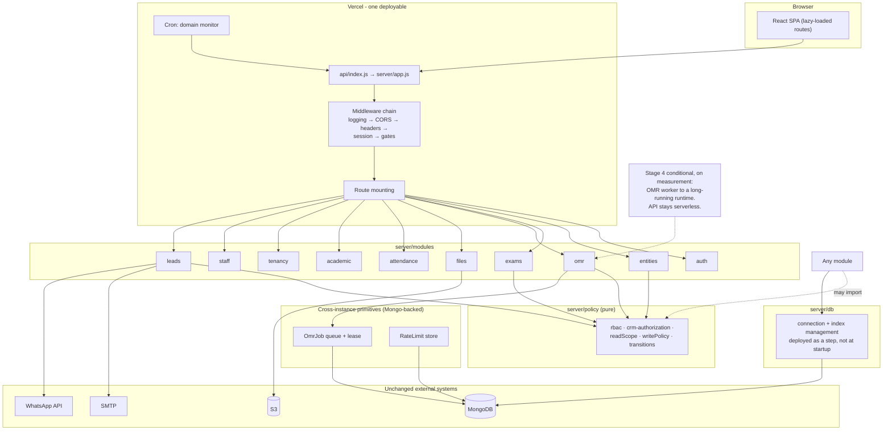

---

## 22. Migration Plan (PROPOSED)

`PROPOSED` — Every step is small, individually reversible, and observable. The invariant across all of them: **`api/index.js` keeps exporting the same `app`, and `npm test` plus the OMR parity check stay green at every commit.**

| # | Step | Addresses | Reversible by | Signal that it worked |
|---|---|---|---|---|
| 0 | Baseline metrics on the current deployment (Stage 1 logging only) | P6 | revert one commit | OMR latency, auth failure rate, and rate-limit trips become visible |
| 1 | Structured JSON logging, same `requestId` propagation | P6 | revert | Log lines are queryable by `requestId`, `tenant_id`, `error_code` |
| 2 | Metrics emitted for OMR, auth, rate limits, audit failures | P6 | revert | Queue-depth and latency baselines exist before any refactor |
| 3 | Server-side `student_limit` and `omr_sheet_limit_per_month` enforcement | P4 | revert | An over-limit write is refused by the API, not by the UI |
| 4 | Examination and Result transition table in `assertRelationshipWrite` | P5 | revert | An invalid or backward transition is rejected with a 409 |
| 5 | `ensure-indexes.js` as an explicit idempotent pre-deploy step, recorded | P8, P9 | revert | A fresh environment converges to the same index set |
| 6 | `User` revocation field honoured in `getUserFromToken` | P11 | revert | A disabled account's existing token stops working |
| 7 | Remove or implement Firebase / Stripe / `Checkout` | P10 | revert | `package.json` matches the actual import graph |
| 8 | `React.lazy` + `Suspense` on the route tree in `src/App.jsx` | P2 | revert | Marketing visitors no longer download the platform console |
| 9 | Introduce `server/app.js`; `index.js` becomes a shim. Move the five dedicated attendance function routes. | P1 | revert | Identical route table; `app.js` owns the middleware chain |
| 10 | Move domain (custom domain / monitoring / hosting) functions to `modules/tenancy` | P1 | revert | `server/test` domain suites unchanged and green |
| 11 | Move lead management to `modules/leads` | P1, P7 | revert | Lead routes behave identically under `requireSuperAdmin` |
| 12 | Move file upload / serve / capability token to `modules/files` | P1 | revert | Upload and serve behaviour byte-identical; no file path changes |
| 13 | Move auth routes to `modules/auth`; move the two gates into `app.js` as declared middleware | P1 | revert | Gate ordering preserved; `rbac.test.mjs` green |
| 14 | Extract `policy/readScope.js`, `policy/writePolicy.js`, `policy/transitions.js` from `index.js`; add the module boundary rule as a lint check | P1 | revert | No module imports another module's `routes.js` (enforced, not just agreed) |
| 15 | Move the OMR functions to `modules/omr`; delete the now-dup `processOmrSheet` alias | P1, P7 | revert | Golden-set parity check unchanged |
| 16 | Replace the `if (fnName === ...)` chain with a declared function registry, each entry carrying its own auth predicate | P7 | revert | Unknown names still 404; each function's auth is declared beside its handler |
| 17 | Introduce `OmrJob`; `processOMRSheet` returns 202; add the worker loop with a lease | P3 | feature flag back to synchronous | A dropped request no longer loses the work; retries are idempotent |
| 18 | UI polls job status instead of holding a 60 s request | P3 | revert | OMR p95 request duration drops; the UI still shows progress |
| 19 | *(conditional, on Stage 1 metrics)* move the OMR worker to a long-running runtime | P3 | redeploy the function | Sustained throughput without function timeouts |

*(Rules for the Stage 2 moves, steps 9–16.)* One route family per commit. No behaviour change in any commit — the test suite and the parity check are the contract. A move that requires a behaviour change is two commits: the move, then the change. The module boundary rule is enforced by a lint check, not by convention.

*(Rollback.)* Steps 1–17 are each a single revert. There is no data migration in steps 1–16, so a revert is always safe. Step 17 introduces a new collection and a new write path for OMR; the rollback is a feature flag returning `processOMRSheet` to the synchronous path, and the `OmrJob` collection can be left in place. Step 19 is the only step whose rollback is a redeployment of a different runtime shape.

---

## 23. Architecture Decision Records

*`PROPOSED` where the decision is a proposal; `CURRENT` where it describes an existing, working choice. Each ADR records the decision, the reason, and the cost accepted.*

### ADR-001 — Modular monolith over microservices

**Status:** `PROPOSED` (the current state is a single-file monolith; this ADR records the direction, not an accomplished change)

**Decision.** Keep one deployable. Extract domain modules behind the existing `api/index.js` export rather than splitting services.

**Reason.** The authorization, tenancy, and audit models are shared across every domain. `rbac.js` is a single pure module precisely because the policy is uniform, and this codebase has already paid for the alternative once: eight independent copies of the role definitions drifted apart. A service split would either duplicate that policy or add a network hop to every authorization decision. Separately, the dominant debt is correctness and operability, not topology.

**Cost accepted.** A single deployment unit means a single blast radius and no independent scaling. Both are addressed by Stage 4 (moving only the OMR worker) rather than by a broad split.

### ADR-002 — Generic entity API with a centralized write matrix

**Status:** `CURRENT`

**Decision.** One generic CRUD surface over 27 named collections, with per-entity per-verb role allowlists in `ENTITY_WRITE_ROLES`, plus a second tenant-context guard in `writeAllowed`.

**Reason.** Every page in the product can be built generically, so a new page costs a component rather than a backend. Centralizing the matrix means one place to audit authorization, and `canWriteEntity` failing closed means an unlisted entity or verb is denied to everyone but the platform owner — the safe default.

**Cost accepted.** The generic surface is only as correct as the guards that wrap it. Every guard in `server/index.js` must be applied to every write route, and the audit history shows this being gotten wrong before (`DELETE /entities/User/:id` refused while `DELETE /entities/User/many` deleted every account in every tenant, unaudited). The mitigation adopted was a shared guard function called from all four routes; the durable fix is a test that asserts parity across routes.

### ADR-003 — Tenant scoping as a read filter with predicate intersection

**Status:** `CURRENT`

**Decision.** `readScope` returns a database-derived predicate; client filters intersect with it and can only narrow.

**Reason.** A denylist of "forbidden" queries is unenforceable in practice; an allowlist of what a role may see is. Intersecting the client's `_id` criteria with the authorized set makes it structurally impossible for a client filter to widen access, and `{_id: null}` is an unambiguous deny.

**Cost accepted.** A read that returns nothing is indistinguishable from a bad filter, and the `readScope` function is long and branch-heavy — one of the strongest arguments for extracting it into `policy/`.

### ADR-004 — Capability tokens for private files

**Status:** `CURRENT`

**Decision.** Private files are served to authenticated callers by session tenant, to platform roles by cross-tenant scan, and to unauthenticated callers (browser `` and `<a>`) by an HMAC capability token carrying the owning tenant and an expiry, signed with `JWT_SECRET`.

**Reason.** A bearer header is impractical for ``. Pre-signed S3 URLs would leak the bucket layout and require a signing round trip per asset; an application-level HMAC over `(tenant, filename, expiry)` is stateless, tenant-scoped, and revocable by rotating `JWT_SECRET`.

**Cost accepted.** The token is derived from `JWT_SECRET`, so rotating that secret invalidates every outstanding file URL at once. `Cache-Control: private, no-store` is required to prevent a cached response surviving the token's expiry.

### ADR-005 — S3 in production, local filesystem only in development, fail fast in production

**Status:** `CURRENT`

**Decision.** `initStorage()` resolves the mode once at startup; production with no valid bucket throws rather than falling back to local disk. A local fallback is available only when `NODE_ENV !== production`, or via an explicit `STORAGE_BACKEND=local` override for hermetic tests.

**Reason.** A serverless function's local disk is ephemeral, so a silent local fallback in production would mean uploaded OMR sheets vanish at the end of the invocation. Failing fast surfaces the misconfiguration at deploy time rather than at the moment a teacher uploads a scan.

**Cost accepted.** Production cannot start without storage configured, which makes local production-like testing require the explicit override.

### ADR-006 — OpenCV WebAssembly rather than the Python engine at runtime

**Status:** `CURRENT`

**Decision.** The deployed evaluator is `evaluator.mjs` on `@techstark/opencv-js` (`ENGINE_VERSION = "1.3.0-js-wasm"`). `evaluator.py` and `requirements.txt` are excluded from the deployment by `.vercelignore` and are used to generate the golden dataset.

**Reason.** The runtime is Node on Vercel. Shipping a Python runtime would mean a second execution environment, native OpenCV dependencies, and a substantially larger function bundle. The WASM build runs in a `worker_thread` and is covered by a 10-case golden parity harness.

**Cost accepted.** `eval-worker.mjs` polyfills `Promise.withResolvers` and `Promise.try` for the WASM build, and `evaluator.py` and `evaluator.mjs` are two implementations of the same algorithm that can drift. The parity harness is the mitigation; the two implementations must be kept in step deliberately.

### ADR-007 — Manual, idempotent index management

**Status:** `CURRENT` (and the subject of migration step 5)

**Decision.** `server/ensure-indexes.js` is run manually, is idempotent, and refuses to modify any existing record. Its duplicate preflight aborts the whole run and reports the conflicts.

**Reason.** Creating indexes at startup would add latency to a cold function and, worse, could fail a deploy on data the code never touched. Failing on duplicates is correct: silently deduplicating admission numbers would destroy identity data.

**Cost accepted.** A fresh environment can serve traffic unindexed if the step is forgotten. Nothing tracks whether it has been run. This is problem P8 and migration step 5.

### ADR-008 — Bearer JWT with per-request re-read, no refresh or rotation

**Status:** `CURRENT`

**Decision.** A 7-day JWT carrying only `{ userId }`, with the `User` document re-read from MongoDB on every request.

**Reason.** Re-reading is what makes authorization state immediately current: a role change, a tenant move, or a verification flip takes effect on the next request with no stale-token window. Carrying only the id also means a token cannot assert its own entitlements.

**Cost accepted.** Every authenticated request costs one `User` lookup, and a token cannot be revoked before its expiry (P11, migration step 6). Long-lived single tokens also mean a leaked token is a week of access.

### ADR-009 — Console logging

**Status:** `CURRENT` (and the subject of migration steps 1–2)

**Decision.** `server/logger.js` emits `[API START]` and `[API END]` lines to the console with a `requestId`, method, path, status, and duration.

**Reason.** Serverless deployments capture stdout in platform logs, so console output is available with no additional dependency.

**Cost accepted.** Lines from concurrent invocations interleave; there is no structure, no level, no metrics, no tracing, and no error reporting. `requestId` makes manual correlation possible but nothing aggregates on it. The consequence is that the OMR failure rate and authentication failure rate are unmeasurable (P6).

### ADR-010 — Fail-open rate limiting

**Status:** `CURRENT`

**Decision.** `runLimit` catches a rate-limit store error, logs a warning, and returns `{count: 0}`, so the request proceeds.

**Reason.** Availability of authentication is preferred over strict throttling. A rate-limit store outage should not become a total authentication outage.

**Cost accepted.** A store outage silently disables throttling for the duration. The compensating control is that the budgets are secondary defence — the primary controls are bcrypt, the delegation matrix, the privilege-state guard, and tenant scoping. This trade-off should be re-examined if a failure-rate budget is ever defined for auth.

### ADR-011 — Impersonation is a client-side view overlay

**Status:** `SUPERSEDED` by ADR-013

**Decision.** ~~`src/lib/impersonation.js` overlays a role and tenant onto the React user object in `sessionStorage`; the real `super_admin` JWT is still sent, and the server enforces full platform privileges.~~

**Reason.** The purpose is to let a platform operator see the tenant UI without a separate impersonation session, server-side state, or an audit trail of impersonated actions — because there are none.

**Cost accepted.** Every request beneath the overlay runs with platform privileges. This is safe only because the overlay changes rendering, not authority, and because the backend's own tenant checks remain in force for anything the real session can reach. The single server-side accommodation (`previewExamRoster` deriving the tenant from the selected `AcademicYear`) is a consequence worth re-examining if impersonation is ever given server-side meaning.

**What invalidated it.** The premise held — the token is still a platform owner's, and there is still no impersonation session or audit trail — but the *consequence* turned out not to be acceptable: the overlay changes rendering while the data stayed platform-wide, so the UI asserted a scope the response contradicted. "The overlay changes rendering, not authority" was true and was the bug. See ADR-013 for what replaced it and what was deliberately not built.

### ADR-013 — The "view as" scope narrows reads and writes; it is not an impersonation session

**Status:** `CURRENT`

**Decision.** The client sends `X-View-As-Tenant` on every request while a `view as` record is present. The server honours it **only** for `super_admin`, treats it as an upper bound on `readScope()`, `resolveStaffTenant()`, the `manageStaff` writes and every body-supplied `tenant_id`, and exempts `Tenant`/`Lead`/`Payment` so an operator can still leave the scope. The token is still a `super_admin` token and the caller can still omit the header.

**Reason.** The reported symptom — a platform owner opening `/staff` and seeing every school's staff under a banner naming one — had two independent causes, and the overlay was the shared root. It hides `super_admin` from the page's platform-owner check, so the picker does not render, no `tenant_id` is sent, and `manageStaff list` answers with the platform-wide read. Fixing only that call site would have left every other page wrong, so the scope had to become a property of the request rather than of one screen.

Narrowing rather than replacing the session is what makes this safe to add to a codebase with this much authorization logic: because the header can only ever *remove* rows the caller could already read, it cannot create an escalation, and a caller that omits it is exactly where it started. A real impersonation token would be the stronger control and is a much larger change — auth middleware, every role predicate, session lifetime, and an audit trail for actions that today have none.

**Cost accepted.** The banner is still not a boundary. A caller who wants the platform-wide view simply does not send the header, so the docs must not describe "view as" as confinement. Nothing is audited about *which* scope a read happened under, so a scoped read is indistinguishable in the log from an unscoped one; the `X-View-As-Tenant` value would have to reach the audit payload for that. A family view is scoped to the school rather than the one child the portal is built around, and the banner says so instead of implying otherwise. `getAssignedTenants`/`setAssignedTenants` are called by `appClient.users.*` but have **no** server implementation at all — the `manageStaff` handler has always fallen through to `{ok: true}`, so the client has been reading a false success. A scoped caller is refused outright there rather than told "ok" for a platform-level action; closing that gap properly is separate work.

### ADR-012 — Status-gated family and teacher reads

**Status:** `CURRENT`

**Decision.** `readScope` applies status predicates: a family member sees only `published` examinations and `published` results, and a teacher sees only `reviewed` or `published` results.

**Reason.** Publication is the moment a result becomes authoritative, and draft results can still change after OMR correction. Withholding them is preferable to showing provisional marks.

**Cost accepted.** This is a read-side control only. Because the underlying status transitions are not validated server-side (P5), a `published` document can be moved back to `draft`, and the read filter will then correctly hide it — hiding a result that was already published. The read gate and the missing transition table compound: the read filter is only as meaningful as the integrity of the status it filters on.

---

## 24. Risks

*(Current, unless labelled otherwise.)* Ordered by consequence. These are risks of the current system, not of the proposals.

| Risk | Evidence | Severity | Mitigation |
|---|---|---|---|
| A guard is applied on one write route and forgotten on another | The privilege-state guard's own comment records `DELETE /entities/User/:id` refusing `User` while `DELETE /entities/User/many` deleted every account in every tenant, unaudited. Mitigated by extracting a shared `userPrivilegeWriteRefused` and calling it from all four routes. | High | A parity test asserting every write route applies every guard (not present today) |
| Unvalidated status transitions corrupt the published record | P5; only the teacher restriction and answer-key freeze are enforced | High | Migration step 4 (transition table) |
| Plan entitlements are not enforceable | P4; browser-only checks | Medium–High, or High if these are commercial terms | Migration step 3 |
| A refactor changes behaviour without anyone noticing | P6; no metrics, no CI, no frontend tests, no E2E | High | Migrations steps 0–2 before any structural change |
| OMR work is lost on a dropped connection or worker timeout | P3; 60 s synchronous worker, no persistence | Medium | Migration step 17 |
| A fresh or restored environment runs unindexed | P8; `ensure-indexes.js` is manual | Medium | Migration step 5 |
| A leaked token is valid for up to 7 days with no revocation | ADR-008, P11 | Medium | Migration step 6 |
| Environment configuration drift between environments | 51 server env vars, no schema; no schema file exists | Medium | A configuration reference generated from the source, and startup validation for required vars beyond `JWT_SECRET` |
| Rate limits are per-process in a multi-instance self-hosted deployment | P13; `MemoryRateStore` whenever `VERCEL` is unset | Medium | `RATE_LIMIT_STORE=mongo`; startup warning when a process count is not provably 1 |
| `evaluator.py` and `evaluator.mjs` drift apart | ADR-006; two implementations of one algorithm, only one deployed | Medium | Keep the golden harness as the shared contract; regenerate golden cases after any evaluator change |
| `OMRCorrection` accumulates records nothing reads | P12 | Low | Decide whether corrections are authoritative history (P12 / §25) |
| Declared-but-unused dependencies mislead readers and reviewers | P10 | Low | Migration step 7 |
| Client-side role mirrors drift from the server | §6.5; the codebase has a history of this | Low | The server is the boundary, so drift is a UX defect, not a security one. Accept it; do not build a generation step for two small files |
| Concentration risk in the OMR WASM bundle | `@techstark/opencv-js` ships inside the function bundle | Low | `includeFiles` and the function size budget are visible in `vercel.json` |

---

## 25. Open Questions

These cannot be answered from the repository. Each is stated with why it matters and who can answer it.

1. **Are `student_limit` and `omr_sheet_limit_per_month` commercial terms?** If they gate revenue, their browser-only enforcement (P4) is a correctness issue, not a UX gap, and migration step 3 is blocking rather than merely early.
2. **What is the intended long-term deployment shape?** Whether the OMR worker can stay inside a `maxDuration: 300` / 1024 MB function (P3) determines whether Stage 4 is on the roadmap at all.
3. **Is an S3 bucket configured and verified in every environment?** `initStorage` fails fast in production, so a misconfigured environment fails at deploy — but nothing asserts that non-production environments match production.
4. **Is `OMR_ENGINE_MODE=mock` ever live in a deployed environment?** It is the only path to a non-CV result (P3 / §13.3). A mock answer reaching a real student's result is a correctness incident; the code requires it to be set explicitly, so the question is operational.
5. **Who runs `ensure-indexes.js`, and when?** P8 has no answer in the repository, and no tracking of which environments have converged.
6. **Is `OMRCorrection` meant to be authoritative?** P12. If corrections are meant to be the record of truth, the evaluation path is currently ignoring them; if they are a UI affordance for a future feature, they should not be writable today.
7. **Should the first-login gate extend beyond `student` and `parent`?** §17.5. Staff provisioned with `PROVISIONING_DEFAULT_PASSWORD` are not blocked from continuing.
8. **Is impersonation expected to become server-side?** ADR-011 assumes it stays a view overlay. If an auditor-facing requirement needs "an employee acting as tenant X" to be a recorded, server-enforced session, that is a different design with a real cost.
9. **What is the expected OMR job volume?** Determines whether the Mongo-backed `OmrJob` queue (Stage 3) is sufficient or a broker is justified. Answerable from Stage 1 metrics.
10. **Is there a retention policy for OMR images, annotated images, and audit logs?** None is declared in code or configuration. OMR images in particular are personal student data.

---

## 26. Appendix: Repository Evidence Index

*(Current.)* Every material claim in this document derives from one of these. Re-verify against the symbol, not the line number.

| File | What it establishes |
|---|---|
| `package.json` | Scripts (`build`, `lint`, `typecheck`, `test`, `test:rbac`), Node `>=20`, ESM, full dependency inventory including `@aws-sdk/client-s3`, `mongodb`, `jsonwebtoken`, `bcryptjs`, `multer`, `@techstark/opencv-js`, `firebase`, `@stripe/*` |
| `vercel.json` | Build command, output dir, function `maxDuration: 300` / `memory: 1024`, OMR `includeFiles` (CV engine, templates, `pdf.worker.mjs`), `excludeFiles` for pdf.js sourcemaps, daily cron, SPA and API rewrites, security headers, CSP |
| `.vercelignore` | Python and golden-set files excluded from the deployment |
| `api/index.js` | Serverless entry: imports and re-exports the Express app |
| `server/index.js` | `allowed` / `publicRead` / `globalOnly`; JWT helpers; session hydration; the two gates; `SECURITY_CSP`; CORS allowlist; `route()`; `present`; `userPrivilegeWriteRefused`; `assertFlatUpdateBody`; `query`; `logServerAudit`; `CLIENT_AUDIT_EVENTS`; `SERVER_AUDIT_EVENTS`; `assignUserRole`; `FROZEN_EXAM_STATUSES`; `TEACHER_VISIBLE_RESULT_STATUSES`; `readScope`; `assertTenantOwnership`; `writeAllowed`; `assertRelationshipWrite`; `isExamWorkflow`; the entire route table; `stageOmrFile`; `runOmrEvaluator`; `processOMRSheet`; `evaluateExamination`; startup and `app.listen` |
| `server/rbac.js` | `APP_ROLES`, `VALID_APP_ROLES`, role groups, `PROVISIONING_HIERARCHY`, `canProvisionRole`, `ENTITY_WRITE_ROLES`, `canWriteEntity`, `canReadAuditLog`, `UPLOAD_PURPOSE_ROLES`, `canUploadPurpose`, `EXTRACT_ROLES`, `TRIAL_ROLES`, `canStartTrial`, `canDeleteOwnAccount`, `resolveReadableTenantId`, `SECRET_ENTITY_FIELDS`, `TENANT_PUBLIC_FIELDS`, `TENANT_ADMIN_FIELDS`, `redactTenant`, `redactTenantBranding`, `redactSecrets`, `CLIENT_QUERY_OPERATORS`, `isSafeQueryValue`, `isEmailVerified`, `VERIFICATION_ALLOWED_PATHS`, `EMAIL_UNVERIFIED_RESPONSE` |
| `server/crm-authorization.js` | `PRIVILEGED_TENANT_ROLES` (re-exported from `rbac.js`, deliberately), `CRM_SCOPED_ROLES`, `studentIdsForUser`, `teacherAssignmentIsValid`, `canAccess` |
| `server/rate-limit.js` | `RATE_LIMITS` table, `getClientIp`, `MemoryRateStore` / `MongoRateStore`, `getRateStore`, `runLimit` fail-open, `tooMany` |
| `server/db.js` | `MONGODB_URI` / `MONGODB_DB`, 8 s timeouts, lazy singleton |
| `server/ensure-indexes.js` | Manual execution, compound per-tenant indexes, partial filters, the two preflight duplicate scans, the never-modify-data contract |
| `server/logger.js` | `installApiLogging`, request id, start/end lines, duration, error capture, `/uploads` skip |
| `server/provisioning.js` | `provisionUser`, `provisionAutoLogins`, `safeUser`, `resolveDefaultStudentPassword`, `PROVISIONING_DEFAULT_PASSWORD` |
| `server/identityResolver.js` | Roster-only matching, typed failure reasons, zero-padding tolerance, `MULTIPLE_ROSTER_MATCHES` |
| `server/examRosterService.js` | `ensureExamRoster`, `getExamRosterStudentIds`, `studentInExamRoster`, `syncEnrollmentRosters`, `deriveEnrolledStudents` |
| `server/examTimetableService.js` | `revealExamMaterial` and `EXAM_MATERIAL_ROLES` gating |
| `server/attendanceService.js` | Attendance authorization, exam attendance, `reconcileExamAbsentees` |
| `server/studentNumberService.js`, `server/admissionNumberUtils.js` | Number allocation and canonicalization |
| `server/academicSetupService.js` | Academic structure authorization and setup |
| `server/lib/s3.js` | `getStorageMode`, `initStorage` fail-fast matrix, `privateKey` / `publicKey`, object CRUD, `downloadToFile`, region and credential resolution |
| `server/lib/domainGuard.js` | Subdomain normalization, reserved words, uniqueness assertions |
| `server/lib/domainVerifier.js` | `REASONS` enum, `humanReason`, injected DNS and fetch, live probe with app-identity check |
| `server/lib/domainMonitor.js` | `verifyCronToken`, `buildDomainAlert`, `createDomainMonitor` |
| `server/lib/hosting.js` | `HOSTING_STATUS`, provider contract, registry |
| `server/lib/vercelProvider.js` | Optional domain-attach automation, registered only when credentials exist |
| `server/lib/activationOrchestrator.js` | `ACTIVATION_STAGE`, the DNS-gate → attach → verify → probe ordering, "never live without a probe" |
| `server/services/emailService.js`, `whatsappService.js`, `leadMessageService.js`, `leadNotificationService.js`, `leadSettingsService.js`, `integrationSettingsService.js`, `crypto.js` | Outbound messaging, settings, secret encryption |
| `server/omr-engine/omr-runner.mjs` | One `Worker` per job, terminate on settle, `OMR_TIMEOUT` |
| `server/omr-engine/eval-worker.mjs` | Job dispatch (`generate` / `corrupt` / evaluate), `Promise` polyfills |
| `server/omr-engine/evaluator.mjs` | `ENGINE_VERSION`, ROI and confidence constants, classification states, `overallStatus` |
| `server/omr-engine/README.md` | The nine-step algorithm, determinism guarantee, template-driven sampling |
| `server/omr-engine/templates/` | `a4_20q_4opt_v1`, `a4_50q_4opt_v1`, `a4_100q_4opt_v1` |
| `server/omr-engine/golden/` | 10 named cases with expectations and inputs, plus `manifest.json` |
| `server/seed.js` | Seeded collections and default plan limits |
| `shared/custom-domain.js` | `validHostname`, `normalizeHost`, `classifyHost`, `isPrivateIp` — shared by browser and server |
| `src/App.jsx` | Full route table, absence of code splitting, marketing / auth / platform / staff / family grouping |
| `src/api/appClient.js` | Token storage key, base URL, `Proxy` entity accessor, `functions.invoke`, `UploadFile`, `manageStaff` routing for `assigned_tenant_ids`, error shape |
| `src/api/firebase.js` | Unused Firebase Storage initialization (P10) |
| `src/lib/AuthContext.jsx` | `/auth/me` hydration, the four auth-error states, token-retention decisions |
| `src/components/ProtectedRoute.jsx` | Loading, error, unauthenticated, unverified, and must-change-password branches |
| `src/lib/roles.js` | Client role mirror, `EXAM_WORKFLOW_ROLES`, `isExamWorkflowRole`, `ROLE_PORTAL`, `rolePortal` returning null |
| `src/lib/permissions.js` | `PAGE_ROLES` and action helpers |
| `src/lib/impersonation.js` | Role/tenant render overlay, exact-`super_admin` gate, source of the `X-View-As-Tenant` scope (see §10.8) |
| `src/lib/roles.js` | Multi-role normalization, `APP_ROLE_PRECEDENCE`, `rolePortal` |
| `server/backfill-app-roles.js` | `app_roles` rollout: dry-run by default, mirrors repaired only when unrecognized |
| `src/hooks/useTenantDomain.js` | Hostname branding detection, `publicSite` branding call, per-host session cache |
| `src/components/exams/ExamWorkflowSteps.jsx` | The six statuses and the six UI steps |
| `src/components/exams/OMRUploadPanel.jsx` | Upload → create sheet → process → auto-evaluate sequence, client-side monthly OMR limit, sequential bulk processing |
| `src/components/exams/ResultsPanel.jsx` | `draft → reviewed → published` driven by generic entity updates |
| `src/components/exams/review/SheetReviewer.jsx` | `OMRCorrection.bulkCreate` (P12) |
| `src/lib/scoreOMR.js` | Client-side mirror of the server scoring |
| `src/pages/Students.jsx` | Client-side `student_limit` check (P4) |
| `src/pages/Checkout.jsx` | Free-trial activation via `startFreeTrial`; takes no payment (P10) |
| `server/test/rbac.test.mjs` | The 40 regression cases behind §9 |
| `server/test/`, `server/test-live/` | What `npm test` and `npm run test:rbac` cover (12 files, 14 live collections) |
| `scripts/` | 21 unwired test harnesses, the OMR parity check, and 6 operational scripts (backfills, migration, audit, screenshots, scratch bucket) |
| `AUDIT_REPORT.md`, `SEC-05-AUDIT-REPORT.md`, `SEC-06-AUDIT-REPORT.md`, `CRM-PHASE-0-AUDIT.md`, `CRM-PHASE-1-AUDIT-REPORT.md`, `CRM-PHASE-2-AUDIT-REPORT.md`, `OMR-CV-PHASE-0-AUDIT.md`, `UI-UX-AUDIT.md`, `USER-PROVISIONING-AUDIT-REPORT.md` | Prior audits in the repository, and the origin of the `SEC-01`…`SEC-07` section banners referenced throughout |

---

*End of document. Sections 1–20 describe the current implementation. Sections 21–23 are proposals. Nothing in this document has been implemented; nothing in it should be read as a description of behaviour that does not exist.*
